# Provenance Methodologies for Multi-Agent Claim-Testing Frameworks: A Cross-Disciplinary Research Brief

This brief surveys provenance methodologies across six research dimensions — classical data provenance, inference and belief tracking, source-contribution quantification, propagation-network trust, and deployed verification infrastructure — and synthesizes them into a unified architecture for multi-agent claim-testing frameworks. The central design proposal is a four-layer provenance stack: a belief layer recording who knew what and when, an evidence layer attributing confidence to specific evidence items, a semantics layer defining agreement through typed argumentation, and a cryptographic layer making all records tamper-evident. A recurring cross-verified finding is that consensus without provenance systematically amplifies correlated errors, because false information enjoys a structural propagation advantage over naive aggregation. Equally important, confidence values are themselves derived artifacts whose inference method, approximation level, and known failure modes must travel with them as provenance metadata. The architecture therefore adopts the subjective-logic opinion (b, d, u, a) as a common trust currency, so that uncertainty is preserved through discounting and fusion rather than flattened into scalar scores. In place of boolean verdicts, the claim lifecycle recognizes five non-affirmative terminal states — UNKNOWN, UNDEC, NEI, DORMANT, and DISPUTED — each queryable and carrying full provenance rather than being treated as an exception. Finally, the cryptographic layer is assigned a deliberately bounded role: signed statements and transparency logs prove origin, attribution, and integrity of records, never the semantic truth of what was asserted. Together these principles turn negative results from dead ends into first-class, auditable objects that drive the next round of claim testing.

## 1. Foundations: Classical Provenance Models

Before introducing the inferential machinery of later chapters — Bayesian inverse planning over mental states, information-theoretic attribution, network-theoretic trust propagation — this chapter fixes the classical vocabulary on which those methods operate. Provenance research has two complementary traditions: a database tradition that formalizes why, where, and how an output was derived from its inputs, and a workflow/system tradition that records which activities and agents produced an artifact [^dim03^4^]. Both converge on a structural insight that a multi-agent claim-testing system inherits directly: a claim is an *entity* with a derivation history, agents and verification steps are *activities* and *actors*, and a claim's credibility is a *computed function of its provenance* rather than an intrinsic property. The World Wide Web Consortium (W3C) PROV standard states this explicitly, defining provenance as information "which can be used to form assessments about its quality, reliability or trustworthiness" [^dim03^12^].

### 1.1 The PROV data model

#### 1.1.1 W3C PROV Entity–Activity–Agent triad and the relations most relevant to claims

W3C PROV, a Recommendation since 30 April 2013, builds every provenance record from three node types: an **Entity** is a thing with fixed aspects; an **Activity** is something that occurs over time and acts upon entities; an **Agent** bears responsibility for an activity, an entity, or another agent's activity [^dim03^12^]. The relation set is the load-bearing part for claim provenance. Beyond generation (`wasGeneratedBy`), usage (`used`), attribution (`wasAttributedTo`), and inter-activity communication (`wasInformedBy`), four relations map almost one-to-one onto the lifecycle of a claim in a propagation loop [^dim03^13^]:

- `wasQuotedFrom` — a claim restated (in whole or part) by an agent who need not be its original author; this is the precise semantics of *claim restatement* across agents.
- `wasRevisionOf` — a derivation whose result is a revised version of the original; this is the standard edge for a claim's version lineage in a proposal–test–revision loop.
- `hadPrimarySource` — distinguishes first-hand evidence from second-hand relay, which later chapters show to be essential because trust decays along relay chains [^cv^H5^].
- `actedOnBehalfOf` — delegation between agents, modeling orchestrator-to-subagent responsibility chains [^dim03^13^].

The PROV family adds an OWL2 ontology (PROV-O), a human-readable notation (PROV-N), and PROV-CONSTRAINTS, whose inference rules (e.g., deriving influence from derivation) can be transplanted as closure and consistency rules over a claim graph [^dim03^14^].

#### 1.1.2 Open Provenance Model and the artifact/process/agent causal graph

PROV's direct predecessor, the Open Provenance Model (OPM, v1.1 published in *Future Generation Computer Systems* 2011), emerged from the community Provenance Challenge series. OPM defines a directed causal graph over artifact, process, and agent nodes, with causal edges `used`, `wasGeneratedBy`, `wasDerivedFrom`, `wasControlledBy`, and `wasTriggeredBy`, plus a core rule set identifying which inferences over the graph are valid [^dim03^11^]. Two OPM design requirements remain directly relevant: technology-agnostic exchange of provenance between heterogeneous systems, and the coexistence of multiple levels of description — a claim chain can be collapsed to a summary or expanded to full granularity on demand [^dim03^11^]. The scientific workflow community that produced OPM also established the practical doctrine that provenance must be captured *retrospectively at execution time* rather than reconstructed afterwards (Taverna, Kepler) [^dim03^15^], and that prospective provenance (the plan) and retrospective provenance (the trace) are distinct layers stitched together by associating an activity with its plan [^dim03^16^]. Cross-verification confirms this as a High-Confidence principle: complete trajectories, not outputs alone, are the precondition for reliable attribution [^cv^H7^].

### 1.2 Algebraic provenance

#### 1.2.1 Why/where/how provenance from database theory; semiring provenance (Green et al. ℕ[X]) and valuation homomorphisms yielding probability/trust/cost scores

The database tradition supplies the analytic counterpart to PROV's descriptive graphs. Why-provenance (Buneman, Khanna, Tan, ICDT 2001) characterizes the *witness sets* of inputs sufficient to explain an output; where-provenance localizes the input position from which output content was copied; lineage (Cui, Widom, Wiener, TODS 2000) operationalizes the same idea as tuple-level back-tracing [^dim03^1^][^dim03^2^]. How-provenance was algebraized by Green, Karvounarakis, and Tannen (PODS 2007) as **provenance semirings**: annotate each input with an indeterminate, propagate annotations along queries with multiplication for conjunctive (joint-use) dependencies and addition for disjunctive (alternative) derivations, yielding a polynomial in $\mathbb{N}[X]$ whose monomials enumerate complete derivation paths and whose coefficients count them [^dim03^6^].

The decisive property is universality: $\mathbb{N}[X]$ admits, for any commutative semiring $K$ and any valuation $v: X \to K$, a unique evaluation homomorphism $\mathrm{Eval}_v: \mathbb{N}[X] \to K$ [^dim03^7^]. One therefore computes provenance once and instantiates it into the probability semiring, the Viterbi semiring $([0,1], \max, \times, 0, 1)$ (strongest single path), tropical (minimum-cost explanation), or fuzzy semirings, obtaining probability, trust, or cost scores of a claim from the *same* polynomial [^dim03^7^][^dim03^22^]. This is the algebraic mechanism by which provenance supports credibility computation — and, notably, the conjunctive-decay/disjunctive-fusion structure recurs independently in subjective-logic trust propagation and Bayesian evidence accumulation [^cv^H5^].

#### 1.2.2 Dual indeterminates for rebuttal handling; absorptive semirings for cyclic reference

Two extensions matter for adversarial, recursive multi-agent settings. Grädel and Tannen extended semiring provenance to full first-order logic with negation using **dual indeterminates** $\mathbb{N}[X, \bar{X}]$: every literal and its negation receive paired indeterminates, and monomials containing $p \cdot \bar{p}$ are quotiented to zero, so contradictory proof trees cancel automatically — an algebraic model of rebuttal [^dim03^8^]. For recursion (mutually supporting claims, i.e., cyclic reference), power-series semirings $\mathbb{N}^{\infty}[[X]]$ and generalized **absorptive** polynomials $S^{\infty}(X)$ provide well-defined semantics; absorption keeps only minimal sufficient support sets, preventing infinite inflation of the provenance annotation [^dim03^9^]. Complementarily, why-not provenance (Chapman and Jagadish, SIGMOD 2009) explains *missing* derivations — which evidence was absent, which step failed — turning rejected claims into actionable diagnostics [^dim03^5^].

### 1.3 Provenance for knowledge units

#### 1.3.1 Nanopublication four-named-graph structure (assertion/provenance/pubinfo) and Trusty URI immutability

The nanopublication model (Groth, Gibson, Velterop, 2010) is the de facto standard minimal publishable knowledge unit: four named graphs — a **head** graph linking the parts, an **assertion** graph containing the claim itself, a **provenance** graph recording how the assertion came about (with PROV vocabulary such as `prov:wasDerivedFrom` and `prov:wasAttributedTo`), and a **publication information** graph recording who created the nanopublication and when [^dim06^4^][^dim06^5^]. Integrity is supplied by Trusty URIs (Kuhn and Dumontier, ESWC 2014), which embed a cryptographic content hash in the URI: any modification yields a new URI, so tampering with a referenced artifact is immediately exposed, and hashing operates at the RDF-graph abstraction level, surviving re-serialization [^dim06^7^]. A nanopublication plus Trusty URI thus constitutes a content-addressed, non-repudiable claim record; recent work extends the model to multi-source assertions with explicit source lineage [^dim06^6^]. One caution from cross-verification applies: cryptographic attestation proves *who said what*, never that *what was said is true* — semantic verification remains a separate layer [^cv^H1^].

#### 1.3.2 Wikidata reference mechanism, deprecated ranks, CiTO citation typing; claim evolution findings (ClaimFlow)

At infrastructure scale, Wikidata demonstrates claim-level referencing in production: each statement carries optional references (properties such as `reference URL`, `stated in`, `imported from`) and a rank — preferred, normal, or **deprecated** — so that superseded statements are retained but demoted rather than deleted, an explicit mechanism for expressing revision history [^dim06^12^]. For typing the *relations between* claims, the Citation Typing Ontology (CiTO) provides over forty machine-readable citation types including `supports`, `confirms`, `extends`, `qualifies`, `disputes`, `refutes`, `corrects`, and `retracts`, together with inverse properties that let a claim answer "who corrected me" [^dim06^15^]. Empirically, the ClaimFlow study (a 2026 preprint, to be read with that caveat) annotated 1,084 claims across 304 NLP papers and scaled to approximately 13,000 papers: 63.5% of claims are never reused, only 11.1% are ever challenged, and widely propagated claims are reshaped through qualification and extension far more often than they are directly confirmed or refuted [^dim06^11^]. A supporting data-quality lesson: OpenAlex's single `is_retracted` boolean misclassified corrected-but-not-retracted papers, demonstrating that claim states must not be flattened into one flag [^dim06^26^]. Together these findings motivate the five ClaimFlow relation labels (support/extend/qualify/refute/background) as the evolution-edge vocabulary for the framework [^cv^H8^].

| Model | Core formalism | Key relation types | Relevance to claim provenance |
|---|---|---|---|
| Why/where/how provenance | Witness sets; input-position mapping | witness, copy-source, derivation path | Minimal sufficient evidence sets for a claim; diagnosis of rejected claims [^dim03^1^][^dim03^5^] |
| Semiring provenance ($\mathbb{N}[X]$) | Commutative semiring polynomials + valuation homomorphism | conjunctive ($\times$) and disjunctive ($+$) derivation | One polynomial per claim instantiable to probability/trust/cost; dual indeterminates model rebuttal; absorptive semirings tame cycles [^dim03^6^][^dim03^7^][^dim03^8^] |
| OPM | Directed causal graph + inference rules | used, wasGeneratedBy, wasDerivedFrom, wasControlledBy, wasTriggeredBy | Causal dependency graph of claim production, multi-granularity [^dim03^11^] |
| W3C PROV | Entity–Activity–Agent data model (PROV-DM/PROV-O) | wasQuotedFrom, wasRevisionOf, hadPrimarySource, actedOnBehalfOf | Standard schema for claim restatement, versioning, primary evidence, delegation [^dim03^12^][^dim03^13^] |
| Nanopublication | Four named graphs + Trusty URI content hash | assertion / provenance / pubinfo links; CiTO typing; deprecated rank | Minimal verifiable, immutable, typed claim unit with revision history [^dim06^4^][^dim06^7^][^dim06^15^] |

The five models are complementary rather than competing. The why/where/how family answers analytic questions about *which inputs suffice*; the semiring layer turns those answers into an algebra in which credibility, cost, and rebuttal are homomorphic evaluations of a single derivation polynomial. OPM and W3C PROV supply the descriptive graph schema — nodes for claims, activities, and agents; typed edges for quotation, revision, primary sourcing, and delegation — with constraint rules that double as consistency checks. Nanopublications package the result into the smallest citable, tamper-evident knowledge unit, while Wikidata ranks, CiTO types, and the ClaimFlow evidence base describe how such units actually evolve: mostly by qualification and extension, rarely by outright refutation. The architectural reading, developed in subsequent chapters, is a layered stack — descriptive record (PROV/nanopublication), algebraic evaluation (semirings), semantic status (CiTO/rank labels), and cryptographic integrity (Trusty URIs) — whose interfaces are already present in the literature [^dim06^4^][^dim03^7^]. Two caveats bound the chapter: ClaimFlow is a recent preprint whose NLP-domain statistics may not transfer [^dim06^11^], and no cryptographic layer can substitute for semantic verification of the claims it attests [^cv^H1^].

## 2. Provenance of Inferred Mental States

Chapter 1 formalized provenance as "where data came from" — W3C PROV triples, semiring polynomials, and nanopublications track the derivation of artifacts. A multi-agent claim-testing framework, however, must answer a harder question: *where did an inference come from*? When an agent asserts that another agent believes a claim, pursues a goal, or is mistaken, that attribution is itself a claim whose provenance must be recorded. This chapter surveys the two families of methods that make inferred mental states auditable: Bayesian inverse planning, which formalizes inference provenance as a probabilistic derivation, and externalized belief-tracking architectures for large language model (LLM) agents, which relocate belief provenance from opaque model internals into explicit, queryable structures.

### 2.1 Bayesian inverse planning as provenance of inference

#### 2.1.1 The Baker/Saxe/Tenenbaum formalization

The foundational result is that reasoning about goals can be framed as inverting a generative planning model. Given a Markov decision process model of goal-directed behavior, Bayesian inverse planning computes a posterior over goals proportional to likelihood times prior, $P(Goal|Actions, Environment) \propto P(Actions|Goal, Environment)\,P(Goal|Environment)$ [^dim01^1^]. The crucial observation for provenance design is that this formula is not merely an estimator but a *derivation record*: any inferred goal is fully reproducible only if three components are logged — the prior, the generative model (environment dynamics plus rationality assumptions), and the ordered evidence sequence. The provenance of an inferred mental state is therefore the triple (prior, generative model, evidence sequence); omitting any component makes the inference unverifiable. The framework also distinguishes online (filtering) inference from retrospective (smoothed) inference and licenses posterior predictive distributions for future behavior [^dim01^2^] — corresponding, in a claim-testing loop, to "update-as-tests-arrive" versus "re-evaluate-after-the-fact" confidence regimes. Extensions within the same family jointly infer beliefs and desires, so that a wrong claim can be root-caused to a *belief error* (false world assumption) rather than a *goal error* (wrong objective) [^dim01^3^], and beliefs, desires, and percepts can be quantitatively co-inferred within a partially observable Markov decision process [^dim01^4^]. Reward-level provenance is covered by Bayesian inverse reinforcement learning, which samples a posterior over reward functions to handle non-identifiability — implying that goal attribution should often remain multi-hypothesis rather than collapsed to a point estimate [^dim01^10^].

#### 2.1.2 Inference trajectories as auditable logs

Sequential Inverse Plan Search (SIPS) operationalizes the provenance idea. SIPS is a sequential Monte Carlo (SMC) algorithm that incrementally extends inferred plans as new actions arrive, maintaining a particle population whose evolution over time *is* the inference trace [^dim01^5^]. Because the underlying agent models are specified as probabilistic programs, inference is performed over both goals and the agent's internal planning processes, making the entire reasoning pipeline — including the observed agent's bounded rationality and even its mistakes — an inferable, hence attributable, object [^dim01^5^][^dim01^6^]. The Gen probabilistic programming system provides the engineering substrate: programmable inference with structured, replayable traces, arguably the closest existing implementation paradigm to a general-purpose "inference provenance record" [^dim01^8^]. Open-ended extensions combine top-down Bayesian filtering with bottom-up proposals so that the hypothesis space itself need not be fixed in advance [^dim01^7^] — directly relevant to claim spaces that are not enumerable.

### 2.2 Evidence accounting

#### 2.2.1 Weight of Evidence

Explainable Goal Recognition based on Weight of Evidence (WoE) decomposes a goal posterior into per-observation log-odds increments, $\log \frac{P(G|O_{1..i})}{P(G|O_{1..i-1})}$, yielding an evidence ledger that attributes each rise or fall of confidence to a specific observation [^dim01^12^]. This is the closest analogue in the literature to what a claim-testing framework needs: attributing claim confidence to specific test outcomes rather than to an opaque aggregate. Plan Recognition as Planning (PRAP) supplies a complementary classical formulation in which likelihoods are computed from planner cost differences over an explicit observation sequence [^dim01^13^]. Together they define the granularity target for confidence provenance: per-evidence, ordered, and additive.

#### 2.2.2 Algorithm and approximation level as mandatory metadata

Exact Bayesian inverse planning is computationally intractable at scale — goal inference at the computational level is NP-hard, so any deployed system must approximate [^dim01^17^]. Approximation, however, is not neutral: a 2024 preprint reports that amortized variational methods such as AVRIL produce systematically narrower reward posteriors, so the inference algorithm itself distorts the confidence it outputs [^dim01^21^]. The consistent design constraint that emerges is that inference algorithm and approximation level must be recorded as first-class provenance metadata — otherwise a narrow posterior reads as false certainty [^cv^CZ7^]. This generalizes to a principle that derived confidence values carry their own methodological provenance, a requirement independently converged upon across evaluation-methodology evidence [^cv^H5^].

### 2.3 Externalizing beliefs in LLM agents

#### 2.3.1 Symbolic and temporal belief ledgers

For LLM-based agents, belief tracking has been successfully externalized into explicit structures. SymbolicToM constructs per-character symbolic belief graphs, updated after each story event and queried by graph traversal, supporting up to third-order beliefs with substantial accuracy and out-of-distribution robustness gains [^dim02^15^]. SimToM implements two-stage perspective filtering — first restrict context to what the target character knows, then answer from that filtered view [^dim02^16^] — while TimeToM maintains temporal belief-state chains that record who knew what from when [^dim02^17^]. These are, functionally, belief ledgers and map directly onto claim-provenance data models.

Table 2.1 compares the principal methods for externalizing or attributing mental states discussed above.

| Method | What it records | Provenance granularity | Limitation |
|---|---|---|---|
| SIPS (2020) | SMC particle population evolving over observations; agent's internal plans | Per-observation inference trajectory | Requires tractable generative model; SMC approximation error |
| Probabilistic programs (Gen, 2017) | Structured, replayable inference traces | Program-level trace of every random choice | Engineering overhead; inference still approximate |
| Weight of Evidence (2023/24) | Per-observation log-odds contribution to goal posterior | Per-evidence additive ledger | Requires enumerable goal set and plan matching |
| SymbolicToM (2023) | Per-agent symbolic belief graphs, event-driven updates | Per-agent, per-event, to third order | Story/belief domain; no statistical confidence semantics |
| TimeToM (2024) | Temporal belief-state chains (self-world vs. social-world) | Per-time-point belief visibility | Chain bookkeeping grows with agents and time |

The table reveals a systematic trade-off between statistical rigor and representational convenience. The Bayesian methods (SIPS, probabilistic programs, WoE) preserve a probabilistic derivation chain — confidence values are reproducible from logged components — but inherit the tractability ceiling of exact inference and must therefore carry approximation metadata. The LLM-side methods (SymbolicToM, TimeToM) sacrifice statistical semantics: belief graph nodes are symbolic assertions without calibrated confidence, which is precisely the criticism leveled at treating beliefs as static, independent hypotheses without temporal coherence [^dim01^19^]. A mature claim-provenance design would compose the two layers: symbolic ledgers supply the queryable "who believes what, since when" structure, while Bayesian evidence accounting supplies calibrated confidence and per-evidence attribution on top of it. Neither layer alone answers both "where the inference came from" and "how much it should be trusted."

#### 2.3.2 The LLM Theory-of-Mind controversy and its design-irrelevant conclusion

Whether LLMs genuinely possess Theory of Mind (ToM) is contested. On the affirmative side, Kosinski reported GPT-4 solving false-belief tasks at roughly a six-year-old child's level, and Strachan and colleagues found human-level performance on a task battery [^dim02^23^]. On the critical side, Ullman showed that trivial perturbations collapse performance, indicating exploitation of spurious correlations rather than belief representation [^dim02^24^][^dim01^20^]; ExploreToM, using program-guided adversarial generation, drove GPT-4o to 9% and Llama-3.1-70B to 0% accuracy, diagnosing unreliable state tracking as a root cause [^dim02^12^]. An intermediate analysis attributes some perturbation failures to missing common-sense inferences rather than absent belief representations [^dim02^26^]. Cross-verification classifies this as a genuine conflict zone [^cv^CZ1^], but with a decisive practical corollary: the engineering consensus does not depend on the philosophical outcome. Because self-reported beliefs and chain-of-thought rationales can be unfaithful and are fragile under distribution shift, belief tracking must be externalized into structured, adversarially stress-tested records and cross-validated against execution traces [^cv^H3^]. For the liras_framework lineage, this means inferred mental states enter the provenance graph only as *externally recorded* attributions — carrying the triple of Section 2.1, the evidence ledger of Section 2.2, and the algorithm metadata that Section 2.2.2 mandates.

## 3. Quantifying Source Contribution

Chapter 2 established that mental-state inference provenance is qualitative: traces, ledgers, and argument graphs record *that* information moved, but not *how much* each source contributed to a claim. This chapter surveys the quantitative machinery — training data attribution (TDA) and information-theoretic flow measures — that assigns scalar, comparable contribution scores, together with the documented controversies that constrain their use in liras_framework.

### 3.1 Data attribution methods

#### 3.1.1 Data Shapley, Datamodels, TRAK, Simfluence: retraining-based contribution scores and their costs

The retraining family computes contribution counterfactually: retrain without a source and measure what changes. Data Shapley treats training points as players in a cooperative game and assigns each point $\varphi_i$, the weighted average of its marginal utility over all coalitions, uniquely satisfying the linearity, null-player, symmetry, and efficiency axioms.[^dim04^2^] Exact computation requires $2^n$ trainings; Monte Carlo permutation sampling with truncation (TMC-Shapley) reduces but does not remove the burden, keeping the method infeasible at large language model (LLM) scale and appropriate only for small, replayable agent coalitions.[^dim04^12^] Datamodels replace enumeration with regression: a simple *linear* surrogate $g(S') = w \cdot \mathbb{1}_{S'} + b$, fit by Lasso on $10^3$–$10^4$ random subset trainings, accurately predicts model outputs, and the fitted weight $w_i$ is itself the contribution score.[^dim04^3^] TRAK engineers this idea to scale: a generalized linear model Newton step yields a closed-form kernel attribution under random projections of gradients, ensembled over tens of models, reaching a Linear Datamodeling Score (LDS) of about 0.49 on CIFAR versus 0.12 for a naive single-kernel average.[^dim04^4^] Simfluence drops the additive assumption entirely, learning a training-process simulator whose per-example multiplicative and additive influence parameters capture redundancy and curriculum effects; it recovers TracIn and influence functions as special cases and halves prediction error on LLM fine-tuning.[^dim04^14^]

The axiomatic elegance of the Shapley family is contested (Conflict Zone CZ6): Beta Shapley relaxes the efficiency axiom and outperforms on mislabel detection, Data Banzhaf is provably the most noise-robust semivalue, and Diehl and Wilson argue that semivalue-based valuation is "arbitrary and gameable".[^cv^CZ6^][^dim04^13^] The practical reading is that the dispute is about whether the utility function is well-defined, not about small-coalition feasibility.

#### 3.1.2 Influence functions and the documented failure modes on LLMs

Influence functions approximate removal counterfactually by a first-order Taylor step: the influence of training point $z$ on test point $z'$ is $-\nabla L(z')^\top H^{-1} \nabla L(z)$, where the inverse Hessian-vector product (iHVP) is the computational bottleneck.[^dim04^9^] TracIn sidesteps the Hessian by accumulating gradient inner products along the training trajectory, at the cost of storing checkpoints.[^dim04^5^]

Whether this family works on LLMs is the largest unresolved dispute in the field (Conflict Zone CZ2). Grosse et al. scaled influence functions to a 52-billion-parameter model using the EK-FAC (eigenvalue-corrected Kronecker-factored approximate curvature) approximation, reporting sparse, abstract, cross-lingual influence patterns — but also a failure mode in which flipping the order of key phrases drives influence to near zero.[^dim04^10^][^dim04^11^] Li et al. report systematic failure on LLMs, attributing it to iHVP approximation error, uncertain fine-tuning convergence, and, most fundamentally, a decorrelation between parameter change $\Delta\theta$ and behavioral change; a simple representation-similarity (RepSim) baseline achieved near-100% accuracy where all influence-function variants failed, and earlier "successes" were reattributed to gradient matching rather than genuine curvature estimation.[^dim04^9^] A third position holds that LLM training violates the empirical risk minimization assumption, and that a debias-and-denoise (DDA) repair restores effectiveness, reaching 93.49% AUC on hallucination-source tracing.[^cv^CZ2^][^dim04^7^] The divergence likely stems from evaluation settings (pretraining versus LoRA fine-tuning; semantic generalization versus harmful-data identification). The operational rule for liras_framework: any influence-function score must carry a derivation record, pass a $\Delta\theta$-behavior sanity check, and be benchmarked against a RepSim baseline.[^cv^M8^]

| Method | Mathematical core | Contribution score type | Computational cost | Documented limitation |
|---|---|---|---|---|
| Data Shapley | Cooperative-game semivalue over coalitions | Scalar $\varphi_i$, signed, axiomatic | $2^n$ trainings; Monte Carlo truncation | Cost at scale; utility noise; "arbitrary and gameable" critique[^dim04^13^] |
| Datamodels | Linear surrogate $2^S \to \mathbb{R}$ via Lasso | Additive weight $w_i$ | $10^3$–$10^4$ subset trainings | Upfront training budget; infeasible for pretraining[^dim04^3^] |
| TRAK | Projected eNTK + model ensemble | Scalar attribution, LDS-validated | Tens of trained models | Requires purpose-trained ensemble; kernel linearization is approximate[^dim04^4^] |
| Influence functions | First-order Taylor with $H^{-1}$ (iHVP) | Scalar $-\nabla L_{test}^\top H^{-1}\nabla L_{train}$ | iHVP approximations (LiSSA/CG/EK-FAC) | Fragile on non-convex deep nets; systematic LLM failure (CZ2)[^dim04^9^] |
| TracIn | Gradient inner products along trajectory | Accumulated trajectory score | Checkpoint storage | Storage cost; identical scores for duplicated points[^dim04^5^] |
| InfoLoss TDA | Posterior predictive entropy increment | Subset score in nats; submodular relaxation | Gaussian-process closed form + ANN retrieval | 2026 preprint; limited validation scale[^dim04^7^] |
| Transfer entropy / Granger | Conditional mutual information / VAR prediction gain | Directed flow in bits or nats | Large-sample density estimation | Common-parent motif bias; predictive, not interventional, causality[^dim04^15^] |

The table exposes a cost–rigor trade-off that runs diagonally through the family. Axiomatically clean scores (Shapley) are exponentially expensive; cheap first-order scores (influence functions) are exactly where the empirical controversies concentrate. Two consequences follow for a multi-agent claim-testing framework. First, no method yields a trustworthy scalar for free: each score is an estimate whose derivation method, approximation level, and known failure modes must travel with it as provenance metadata — the cross-verified principle that derived confidence values carry their own provenance.[^cv^H5^] Second, the additivity assumption shared by most scalar methods is empirically wrong (Simfluence's non-additivity evidence; InfoLoss's critique of double-counting near-duplicates), so contribution scores should be stored as score-plus-context rather than bare numbers.[^dim04^14^][^dim04^7^]

### 3.2 Information-theoretic provenance

#### 3.2.1 Bayesian InfoLoss TDA: entropy increments in nats as source contribution scores

A 2026 preprint by Tailor, Felicioni, and Ciosek reformulates attribution in explicitly information-theoretic terms: the contribution of a subset $S$ is the *information loss* — the increase in posterior predictive entropy, measured in nats, at a query point when $S$ is removed from training.[^dim04^8^] This criterion credits sources for resolving epistemic uncertainty rather than label noise, which is precisely the semantics of "where does the information in this claim come from". Implementation uses a neural tangent kernel Gaussian-process surrogate with closed-form scores; relaxing to an information-gain objective yields submodularity with a greedy $(1 - 1/e)$ guarantee, and a variance-corrected squared inner-product score makes attribution retrievable via approximate nearest-neighbor search in vector databases, at cost comparable to modern influence-function pipelines.[^dim04^7^] Single-point InfoLoss aligns with classical influence scores, while subset scoring automatically promotes diversity, mitigating the double-counting of near-duplicate evidence. Confidence is Medium pending wider validation.[^cv^M9^]

#### 3.2.2 Transfer entropy / Granger causality for black-box agent message-flow provenance

For provenance *between* agents, the object of interest is a timestamped message stream, and model internals may be inaccessible. Transfer entropy (TE) measures directed information transfer as a conditional mutual information, $T_{J\to I} = I(I_{n+1}; J_n^{(l)} \mid I_n^{(k)})$, overcoming the symmetry of mutual information to distinguish driver from responder.[^dim04^15^] Granger causality operationalizes the same intuition as predictive improvement in vector autoregression, and Barnett, Barrett, and Seth proved the two are exactly equivalent for Gaussian variables ($\mathrm{GC} = \mathrm{TE}/2$), unifying predictive causality and information flow.[^dim04^16^] Because TE/Granger require only observable message sequences, they apply to black-box agents without touching weights. Documented limitations: high-dimensional density estimation needs many samples, bivariate TE is biased by common-parent motifs in network inference, and Granger causality is predictive rather than interventional.[^dim04^15^]

### 3.3 Implications for claim confidence attribution

#### 3.3.1 Two-layer design: InfoLoss for within-claim evidence, TE/Granger for inter-agent information flow

The evidence converges on a two-layer design for liras_framework. Within a claim, evidence-item contribution is scored by InfoLoss-style entropy increments: scores are in nats, comparable across sources, retrievable from a vector database, and submodularity controls additivity when evidence overlaps.[^dim04^8^] Between agents, transfer entropy and Granger causality assign directed contribution to message flows — "which upstream message reduced the downstream agent's predictive uncertainty" — without requiring white-box access, and the Gaussian equivalence $\mathrm{GC} = \mathrm{TE}/2$ lets a cheap linear Granger screen precede a nonlinear TE audit.[^dim04^16^] Because both layers natively report in nats or bits, their scores are commensurable and can be fused into a single contribution record per claim. Two guardrails follow from the Conflict Zones: influence-function variants may be used inside agents only with the CZ2 safeguards (RepSim baseline, sanity checks, derivation metadata), and Shapley-style valuation only when the agent coalition is small and replayable.[^cv^CZ2^][^cv^CZ6^] Every derived contribution score carries the `{method, approximation_level, known_failure_modes}` tuple, implementing the cross-cutting principle that confidence values themselves have provenance.

## 4. Provenance in Propagation Networks

Chapters 1–3 treated provenance as a static property of individual claims: who said what, with which evidence. Multi-agent systems such as liras_framework, however, propagate claims through a network in which each relay transforms the epistemic status of what it carries. This chapter treats provenance dynamically: how to localize the origin of a circulating claim, how trust decays and fuses along propagation chains, and how argumentation structure makes support and attack relations auditable. A cross-cutting finding motivates everything below: consensus without provenance systematically amplifies error, because false information enjoys a structural propagation advantage and naive averaging hands control to high-centrality or stubborn agents [^cv^H2^].

### 4.1 Source localization

#### 4.1.1 Rumor centrality, observer methods, and dynamic message passing

Source localization formalizes "where did this claim originate" as a Bayesian inverse problem on the propagation subgraph. Shah and Zaman's rumor centrality counts, for each candidate node, the number of diffusion sequences consistent with the observed snapshot; the maximizer is the maximum likelihood (ML) estimator of the source on regular trees under the continuous-time susceptible–infected (SI) model, with detection probability strictly positive on regular trees and approaching one on geometric trees [^dim05^21^]. The estimator degrades gracefully: on general random trees detection probability remains strictly positive, and on arbitrary graphs rumor centrality is a well-performing heuristic computable in $O(N)$ on a breadth-first tree [^dim05^21^][^dim05^23^]. For susceptible–infected–recovered (SIR) dynamics, the Jordan infection center provides a sample-path alternative provably within constant hop distance of the true source [^dim05^24^].

When only a few instrumented "observer" nodes record when they first heard a claim, the Pinto–Thiran–Vetterli method localizes the source by minimizing the variance of arrival-time differences, which is equivalent to ML on trees [^dim05^22^]. This is the engineering-friendly option: only a handful of timestamping observers are needed to identify the first-speaking agent. At the richest end, belief-propagation methods for epidemic inversion (Altarelli et al., Physical Review Letters 2014; Lokhov et al.'s dynamic message passing, DMP) produce a posterior over "who told whom" — a probability for every node being the source and for every transmission edge — at $O(E)$ complexity on sparse networks, outperforming rumor centrality [^dim05^15^][^dim05^19^]. Loopy belief propagation on graphs with cycles is approximate but well understood, with fixed points corresponding to Bethe free-energy stationary points [^dim05^14^][^dim05^18^]. For liras_framework, the cross-verified recommendation is to deploy the cheap eccentricity-plus-closeness baseline first and escalate to DMP posteriors for high-value claims [^dim05^25^][^cv^H6^].

### 4.2 Trust along chains

#### 4.2.1 Subjective logic: discounting and cumulative fusion

Jøsang's subjective logic represents a claim's epistemic status as an opinion $\omega = (b, d, u, a)$ — belief mass, disbelief mass, uncertainty mass (with $b + d + u = 1$), and a base rate $a$ — corresponding to a Beta/Dirichlet posterior [^dim05^11^][^dim05^13^]. Two operators make it a propagation algebra. The discounting operator models a relay: agent $A$'s trust in agent $B$ discounts $B$'s opinion about claim $X$, raising $u$ in proportion to $A$'s distrust — formalizing "third-hand information is uncertain" while preserving rather than hiding that uncertainty [^dim05^11^][^dim05^12^]. Cumulative fusion merges opinions arriving over independent paths, and $u$ decreases as independent evidence accumulates [^dim05^12^][^dim05^13^]. This "conjunctive decay along paths, disjunctive fusion across paths" pattern is cross-verified across three independent research dimensions [^cv^H5^], and the opinion quadruple is the recommended confidence currency for liras_framework: consensus thresholds should require both $u < \tau$ and $b > \tau'$, with high-uncertainty claims continuing to propagate but marked undecided rather than flattened to false.

#### 4.2.2 EigenTrust and Sybil-resistant reputation

For global reputation, EigenTrust assigns each peer a trust value from the dominant eigenvector of the normalized local-satisfaction matrix, computed by distributed power iteration, and demonstrably reduces inauthentic downloads even against cooperating malicious peers [^dim05^1^]. Two caveats apply. First, row normalization dilutes the per-edge weight of agents that issue many ratings — "trust is not a finite resource" — so EigenTrust-style weights should not be inserted into discounting chains without correction [^dim05^7^][^cv^CZ9^]. Second, eigenvector reputation is only as sound as its Sybil defenses: under a fast-mixing assumption on the social graph, SybilGuard and SybilLimit bound the trust obtainable per attack edge to $O(1)$ and $O(\sqrt{n \log n})$ respectively, and Advogato's max-flow metric caps the total trust injectable through few attack edges [^dim05^28^][^dim05^29^][^dim05^9^]. For a young agent network, the operational rule is an attack-edge budget: a new agent's attainable reputation is a function of the trusted edges it has legitimately earned, not of identities it can mint [^cv^M10^].

### 4.3 Argumentation as provenance structure

#### 4.3.1 Dung's abstract argumentation: attack graphs and grounded semantics

Dung's abstract argumentation framework (AAF) models arguments as nodes and attacks as edges of a directed graph $\langle A, R \rangle$; acceptability semantics (grounded, complete, preferred, stable) then determine which arguments are jointly acceptable, with status expressible as a three-valued IN/OUT/UNDEC labelling [^dim09^1^][^dim09^2^]. Because acceptability is fully determined by the graph, every claim's status traces to the attack and defense chains behind it — the graph is the provenance record. The grounded semantics is the conservative default for consensus: it is unique, and its UNDEC label explicitly separates "insufficiently adjudicated" from "accepted" or "defeated", preventing false consensus [^dim09^2^][^cv^M14^]. This replaces naive majority voting with a semantics that knows what it does not know.

#### 4.3.2 ASPIC+: a typed vocabulary for attacks

ASPIC+ instantiates abstract argumentation with structured arguments built from premises and strict/defeasible rules, and refines attack into three subtypes: undermining (attacking a premise), rebuttal (attacking a conclusion via the opposite claim), and undercutting (attacking the applicability of an inference rule) [^dim09^3^][^dim09^4^]. These map one-to-one onto the failure taxonomy of claim verification: premise error (the cited evidence is unreliable), conclusion conflict (counter-evidence supports the negation), and inference failure (the evidence does not warrant the conclusion). Requiring every attack edge in liras_framework to carry an ASPIC+ type plus its supporting evidence turns "agents disagree" into an auditable, typed provenance structure [^dim09^3^][^cv^H8^].

#### 4.3.3 LLM debate: documented gains and failure modes

Multi-agent debate (MAD) is the dynamic process that populates the argumentation graph, and its evidence base is deliberately two-sided. Documented gains include improved factuality and reduced hallucination (Du et al., ICML 2024) and superior consensus from heterogeneous, confidence-weighted panels (ReConcile, ACL 2024); same-model debates fail for lack of diversity [^dim09^9^][^dim09^12^]. Documented failure modes are systematic: agents amplify each other's errors, weak agents drag down strong ones, longer debates can degrade performance [^dim09^14^]; correlated training makes majority opinions dominate even when systematically wrong, locking in echo-chamber conclusions [^dim09^13^]; cross-agent sycophancy suppresses productive disagreement and produces premature consensus [^dim09^16^]. The cross-verification resolution (Conflict Zone CZ8) locates the benefit conditions precisely: heterogeneity for error decorrelation, external evidence anchoring, and judge-checkable granularity of disputed sub-claims [^cv^CZ8^]. Since large language models cannot reliably self-correct without external feedback [^dim09^17^], debate in liras_framework must be anchored to retrieved evidence — a FEVER-style rule in which a verdict without evidence spans counts for nothing in consensus aggregation [^dim09^20^][^cv^H4^].

Table 4.1 consolidates the nine techniques discussed, with their network-theoretic basis, guarantees, and failure modes.

| Technique | Network-theoretic basis | What it guarantees | Failure mode |
|---|---|---|---|
| Rumor centrality | ML estimation on SI diffusion trees | Exact ML source on regular trees; positive detection probability generally [^dim05^21^] | Heuristic on non-tree graphs; degrades with partial snapshots |
| Observer method (Pinto et al.) | Arrival-time variance minimization | ML-equivalent on trees with few sensors [^dim05^22^] | Requires instrumented observers and timestamps |
| DMP / belief propagation | Bayesian inversion of SIR dynamics | Posterior over source and transmission edges; $O(E)$ [^dim05^15^][^dim05^19^] | Approximate on loopy graphs; model mismatch |
| Subjective logic discounting | Opinion algebra on trust chains | Trust decay with preserved uncertainty [^dim05^11^] | Requires calibrated referral-trust inputs |
| Cumulative fusion | Evidence accumulation across independent paths | $u$ decreases with independent corroboration [^dim05^12^] | Correlated paths falsely read as independent |
| EigenTrust | Dominant eigenvector of normalized trust matrix | Global reputation robust to cooperating malicious peers [^dim05^1^] | Normalization dilution; Sybil collectives without seed trust [^dim05^7^] |
| SybilGuard / Advogato | Fast-mixing social graph / max-flow cuts | Attack-edge budgets bound Sybil trust [^dim05^28^][^dim05^9^] | Fast-mixing assumption fails on clustered graphs |
| Dung AAF | Directed attack graphs with acceptability semantics | Unique grounded labelling; UNDEC blocks false consensus [^dim09^1^][^dim09^2^] | Garbage-in: semantics cannot detect wrongly typed edges |
| ASPIC+ | Structured arguments from defeasible rules | Typed attacks mapping to premise/conclusion/inference failure [^dim09^3^] | Preference/rule construction burden; disputes collapse without evidence anchoring [^dim09^17^] |

The table exposes a structural pattern across rows: every technique guarantees correctness only relative to assumptions that the network itself can violate. Source estimators assume an observed subgraph; observers must be placed before propagation; fusion assumes path independence; reputation assumes a Sybil budget; argumentation semantics assume correctly typed edges. None is self-sufficient, but their failure modes are complementary rather than overlapping — discounting preserves the uncertainty that point estimators discard, grounded UNDEC absorbs the disputes that fusion cannot resolve, and evidence-anchored debate supplies the typed edges that abstract semantics require. The design consequence for liras_framework is layered composition: localize sources with the cheapest adequate estimator, propagate confidence as opinions rather than scalars, gate consensus on argumentation semantics, and record per-agent lineage so that correlated supporters are discounted before any aggregation [^cv^H2^][^cv^H5^].

## 5. Verifiable Provenance in Practice

Preceding chapters established what provenance should record and how it propagates. This chapter surveys the verification mechanisms that are actually deployed or engineering-ready in 2026, and evaluates what each can and cannot establish. The organizing finding is consistent across retrieval-augmented generation (RAG) citation checking, content credentials, watermarking, and cryptographic logging: provenance systems prove origin and attribution, not semantic truth.[^cv^H1^]

### 5.1 Attribution in RAG systems

#### 5.1.1 Citation quality metrics and audit findings

The ALCE benchmark (Automatic LLMs' Citation Evaluation) operationalized citation quality as a pair of natural language inference (NLI) judgments: citation recall (whether a statement is supported by its cited sources) and citation precision (whether each citation genuinely supports its associated statement). Even the best 2023 models lacked complete citation support for roughly 50% of statements on ELI5.[^dim08^36^] A human audit of four commercial generative search engines (Bing Chat, NeevaAI, Perplexity, YouChat) found that on average only 51.5% of generated sentences were fully supported by their citations and only 74.5% of citations supported their associated sentence.[^dim08^44^] These numbers measure different objects — recall at statement level versus sentence-level support — and must not be cited interchangeably; all additionally carry the noise of the underlying NLI judge, since automatic attribution evaluators themselves reach only about 80% macro-F1.[^cv^CZ4^][^dim08^77^]

A second failure mode is misattachment at the frontier: a qualitative analysis of o3 answers found that in roughly 60% of cases the claims contained information drawn from the model's own memory that went beyond the cited snippets — a real source is cited, but the claim does not come from it.[^dim08^192^] ContextCite addresses this by asking not "what did the model cite?" but "which parts of the context actually caused the statement?", framing context attribution as an external verification problem that can distinguish grounded generation from misinterpretation and fabrication.[^dim08^175^]

#### 5.1.2 Source existence is not source support

The recurring structural lesson is that "the source exists" does not entail "the source supports the claim." Misattached citations are more dangerous than fabricated ones because they survive existence checks; only entailment verification against the cited span detects them.[^dim08^44^][^dim08^192^] A claim-testing framework must therefore treat citation recall and precision as an inseparable report pair and route high-value claims through multi-judge or human spot-checks given the ~20% error rate of automatic evaluators.[^dim08^77^]

Chain-of-thought (CoT) traces cannot substitute for this evidence chain. Hint-injection experiments show Claude 3.7 Sonnet acknowledges using answer-influencing hints only 25% of the time and DeepSeek-R1 only 39%; outcome-based reinforcement learning did not raise faithfulness beyond 28%.[^dim08^127^] CoT explanations can systematically misrepresent the true reason for a prediction, functioning as post-hoc rationalization.[^dim08^112^] Notably, monitorability research finds the same CoT can be unfaithful yet still monitorable — the two properties are distinct — but directly penalizing "bad thoughts" induces obfuscation, making monitorability a fragile equilibrium.[^cv^CZ5^] CoT may serve as an auxiliary signal, never as a claim's evidence chain, and any faithfulness figure must name its measurement method, since different measures diverge by up to 12.9 percentage points on identical data.[^cv^CZ5^]

### 5.2 Content provenance standards

#### 5.2.1 C2PA: declarative provenance and its limits

The Coalition for Content Provenance and Authenticity (C2PA) manifest packages assertions, a claim digest, and a claim signature (COSE_Sign1 over an X.509 chain rooted in the C2PA Trust List) into a JUMBF container bound to the asset by hash.[^dim07^20^] Critically, C2PA is a declarative system: a valid signature certifies only that metadata is unmodified since signing and attributable to a key — it does not certify the semantic truth of the assertions. A manifest claiming human authorship of AI-generated pixels can be cryptographically valid.[^dim07^36^] The Nikon Z6III incident operationalized this: within about a week of the 2025 firmware launch, a researcher used the camera's multiple-exposure mode to make the device sign a manipulated image it had not captured, and the forged file passed standard verification tools; Nikon suspended the service and revoked every certificate. The cryptography was never broken — the signer was fed false input.[^dim07^52^]

#### 5.2.2 Watermarking and the layered-defense consensus

Text watermarking (KGW's green-list logit bias; SynthID-Text's tournament sampling, deployed on Gemini with ~20 million live responses at TPR 85% @ FPR 1%) faces both theoretical impossibility results — for a sufficiently good language model even the best detector performs only marginally above chance — and practical attacks.[^dim07^72^][^dim07^80^][^dim07^88^] The DIPPER paraphraser dropped DetectGPT accuracy from 70.3% to 4.6% at 1% false-positive rate; watermark stealing under a $50 query budget achieved over 80% spoofing and scrubbing success; invisible image watermarks are provably removable by regeneration attacks, and Tree-Ring semantic watermarks fell from 0.993 to 0.153 ROC AUC under a 2025 surrogate-detector attack.[^dim07^96^][^dim07^104^][^dim07^124^][^dim07^125^] The controversy is partly one of settings: impossibility results assume adaptive, all-powerful adversaries while deployment figures assume none (CZ3).[^cv^CZ3^] The 2026 industry consensus is accordingly layered — C2PA metadata (rich context, easily stripped) plus invisible watermark (transform-resilient, low information) plus platform detection — as in OpenAI's May 2026 combination of C2PA Conforming Generator status with Google's SynthID.[^dim07^132^] The asymmetric consequence for any claims framework: absence of a provenance signal is not evidence of human authorship and must be encoded as UNKNOWN, not FALSE.[^dim07^133^]

### 5.3 Cryptographic provenance infrastructure

#### 5.3.1 Signed statements and transparency logs

The strongest deployed pattern combines issuer-signed statements with append-only Merkle transparency logs. Certificate Transparency (RFC 6962), Sigstore's Rekor, Sigsum, and the IETF SCITT architecture share one kernel: inclusion proofs show an entry is in the log, consistency proofs show history was not rewritten, and gossip among witnesses detects split-view misbehavior.[^dim10^27^][^dim10^195^] This yields tamper-evidence, not tamper-proofing — detection, not prevention. SCITT, now in the RFC Editor queue, generalizes the model to arbitrary Signed Statements with COSE_Sign1 receipts, making it the closest standardized vehicle for registering agent claims.[^dim10^195^]

#### 5.3.2 The oracle problem as the fundamental boundary

Academic evaluations converge: blockchains guarantee that on-chain records are immutable but cannot guarantee that off-chain inputs were true — "garbage in, gospel out"; the oracle's trustworthiness comes from off-chain institutions, not the ledger.[^dim10^98^][^dim10^106^][^dim10^138^] The one proven counterexample is software supply chain: Sigstore/SLSA works because the build system signs provenance at the moment of generation — the oracle gap is zero.[^dim10^131^] The operational rule follows directly: sign claims at the generation point, by the runtime that produced them, not by retrospective registration. Provenance infrastructure can commit to "which identity said what, when" — attribution is provable; truth is not.[^cv^H1^]

#### 5.3.3 Verifiable Credentials and agent identity

W3C Verifiable Credentials (VC) Data Model 2.0 (Recommendation, May 2025) standardizes issuer-signed credentials verifiable offline, accommodating Data Integrity proofs, JOSE/COSE, and SD-JWT; Decentralized Identifiers (DIDs) supply issuer identifiers, though each DID method carries its own trust root.[^dim10^150^][^dim10^158^] The VC model compresses trust to "issuer honesty plus key security" rather than eliminating it.[^dim10^166^] Agent-specific identity is now standardizing: Google's A2A v1.0 (January 2026) introduced Signed Agent Cards for cryptographic verification of who issued a card — explicitly not certification of the agent's data — and the IETF webbotauth working group applies RFC 9421 HTTP Message Signatures to agent traffic, already deployed by Cloudflare for agents including ChatGPT.[^dim10^178^][^dim10^186^]

| Mechanism | What it proves | What it does NOT prove | Documented attack/failure |
|---|---|---|---|
| ALCE-style citation check | Cited span entails statement (NLI judgment) | Statement truth; judge accuracy (~80% F1) | 50% of statements lack full support; o3 ~60% memory leakage[^dim08^36^][^dim08^192^] |
| Entailment verification | Source supports the claim, not merely exists | Evidence completeness; cross-method comparability | Misattached citations; evaluator ~20% error[^dim08^44^][^dim08^77^] |
| ContextCite | Actual causal context behind a statement | That model-declared citations are honest | Surrogate/model access assumptions (research-stage)[^dim08^175^] |
| C2PA manifest | Metadata unmodified since signing; signer key | Semantic truth of assertions | Nikon Z6III signer spoofing; re-signing; soft-binding collisions[^dim07^52^][^dim07^36^] |
| Text watermark (KGW/SynthID) | Positive AI-origin signal when detected | Absence of watermark ≠ human-made | DIPPER paraphrase; $50 stealing/spoofing; impossibility bounds[^dim07^96^][^dim07^104^] |
| Merkle transparency log | Entry inclusion; history not rewritten | Log operator honesty pre-gossip; input truth | Split-view without witnesses; detection only[^dim10^27^] |
| Verifiable Credentials | Issuer identity; credential integrity | Truth of issuer's claims about subject | Issuer dishonesty; key compromise; DID-method trust roots[^dim10^166^][^dim10^158^] |

The table's column structure itself encodes this chapter's thesis: every mechanism's middle column is a statement about origin, and every right-hand column is a way the semantic layer escapes the cryptographic one. Two implications follow for downstream synthesis. First, the failure modes are complementary rather than redundant — NLI judges err statistically, signers are fed false inputs, watermarks are paraphrased away, and logs can only detect — so layered composition is an engineering necessity, not a preference.[^dim07^132^] Second, every mechanism shares one blind spot: none reaches the truth of the asserted content. Verification layers must therefore supply what provenance structurally cannot — independent evidence retrieval and claim-level testing — while provenance layers supply what verification cannot: non-repudiable attribution and tamper-evident history. Chapter 6 assembles these into a unified architecture in which signed claims are registered at generation time, negative results are first-class states rather than absences, and no layer is asked to prove what it cannot.[^cv^H1^]

## 6. A Unified Provenance Architecture for the Claims Framework

The preceding chapters surveyed five methodological landscapes: classical provenance models (Chapter 1), provenance of inferred mental states (Chapter 2), source-contribution quantification (Chapter 3), propagation and argumentation networks (Chapter 4), and verifiable provenance in practice (Chapter 5). This chapter synthesizes them into a single implementable architecture for liras_framework, organized around three observations. First, no two surveyed methods compete at the same abstraction layer: belief ledgers, evidence accounting, semantics of agreement, and cryptographic registration are orthogonal, and their interfaces already exist in the literature. Second, one mathematical representation — the subjective-logic opinion — is expressive enough to serve as a common currency across semiring scores, argumentation strengths, and posterior widths. Third, the five "non-affirmative" states independently discovered across dimensions (UNKNOWN, undecided, not-enough-information, dormant, disputed) are instances of a single design axiom: a provenance system's value lies in recording what it does not know.

### 6.1 The four-layer architecture

#### 6.1.1 Belief layer, evidence layer, semantics layer, cryptographic layer

The architecture stacks four layers whose interfaces are borrowed directly from the surveyed standards. The **belief layer** externalizes what each agent knows, following the design axiom (established in Chapter 2) that LLM-internal belief tracking and self-reported reasoning are unreliable as provenance carriers [^cv^H3^]: each `Agent` maintains a SymbolicToM-style per-agent belief graph with visibility-window annotations ("who knew what, from when"), updated event-driven rather than introspected. The **evidence layer** records where confidence comes from: each claim maintains a Weight-of-Evidence-style ledger of evidence items with per-item contributions [^dim01^12^], and a semiring provenance polynomial in which conjunction composes evidence along a path and disjunction merges independent paths, instantiable by valuation homomorphism to trust, probability, or access-control readings [^dim03^6^][^dim03^7^]. The **semantics layer** defines what agreement means: support/attack edges between claims are typed with the ASPIC+ three-way distinction (undermining, rebuttal, undercutting) [^dim09^3^], claim records follow the PROV-DM Entity–Activity–Agent triad with `wasRevisionOf`/`wasDerivedFrom` relations [^dim03^12^], and consensus verdicts are computed under grounded semantics yielding IN/OUT/UNDEC rather than a boolean [^dim09^2^]. The **cryptographic layer** makes the other three non-repudiable: every claim state change is signed at generation time as a SCITT-style Signed Statement and appended to an append-only Merkle transparency log, returning a receipt [^dim10^23^][^dim10^1^], with Trusty-URI content addressing for claim identity [^dim06^7^]. The nanopublication four-graph structure of Section 1.3.1 supplies the record schema that slots all four layers into one minimal unit [^dim06^4^].

```mermaid
flowchart TD
    subgraph L1[Belief layer]
        BG[Per-agent belief graphs<br/>SymbolicToM-style, visibility windows]
    end
    subgraph L2[Evidence layer]
        WL[WoE evidence ledger]
        SP[Semiring provenance polynomial<br/>N&#91;X&#93; + dual indeterminates x/x&#772;]
        WL --> SP
    end
    subgraph L3[Semantics layer]
        AF[Argumentation graph<br/>ASPIC+ typed edges]
        GS[Grounded semantics<br/>IN / OUT / UNDEC]
        AF --> GS
    end
    subgraph L4[Cryptographic layer]
        SS[SCITT Signed Statements<br/>signed at claim generation point]
        ML[Append-only Merkle log<br/>receipts + witness checkpoints]
        SS --> ML
    end
    BG -->|belief updates as events| WL
    SP -->|opinion-valued confidence| AF
    GS -->|state transitions| SS
    ML -.->|tamper-evident receipts<br/>audit all layers| L1
```

The data flow is bottom-up for evaluation and top-down for accountability: belief updates feed evidence polynomials, which feed argumentation semantics, whose verdicts are the exact artifacts signed and logged; the log in turn anchors audits of every layer above it. This layering respects the strongest cross-verified axiom of the survey: cryptography proves who said what and that records were not altered, but never that what was said is true — semantic truth is the verification layer's job [^cv^H1^].

### 6.2 The trust currency

#### 6.2.1 Subjective-logic opinion (b, d, u, a) as the common currency

Four surveyed formalisms independently rediscovered the same requirement — that second-order uncertainty must travel with each claim — and subjective logic is the only one that has algebraized it with a mature operator library. The opinion tuple $\omega = (b, d, u, a)$ defined in Section 4.2.1 connects the four layers: semiring conjunction/disjunction over provenance polynomials is algebraically mirrored by the discounting and cumulative-fusion operators introduced there (decay along a referral chain with $u$ rising; merging of independent paths with $u$ falling) [^dim05^11^][^dim05^12^][^dim03^6^]; the quantitative bipolar argumentation frameworks of Chapter 4 assign numerical acceptability but carry no uncertainty mass, which the $u$ component supplies; and the evidence-accounting finding that posterior width is itself provenance information [^dim01^10^] is exactly the distinction a point estimate destroys and an opinion preserves. The encoding "absence of signal = UNKNOWN, not FALSE" [^dim07^133^] is precisely the functional role of $u$. Consequently the `Claim` dataclass should store an opinion quadruple rather than a scalar score; each hop of `ClaimNetwork.broadcast` applies discounting parameterized by the forwarder's trust, independent support paths merge by cumulative fusion, and consensus adopts the double threshold $u < \tau \land b > \tau'$, so high-uncertainty claims keep propagating but are flagged as undecided. Derived values must additionally carry a `derivation` metadata tuple (method, version, approximation level, known failure modes, evaluator error rate), since Chapter 2 and Chapter 5 showed that the same evidence yields different confidence values under different inference algorithms and evaluators [^dim01^21^][^dim08^825^]; values from different methods are mapped into opinions before fusion, with evaluator error as an extra discounting factor.

### 6.3 The claim lifecycle state machine

#### 6.3.1 Forward verification, backward provenance, root-cause decomposition, revision

Chapters 4 and 5 separated the forward pipeline ("is this claim right?": SAFE-style atomic decomposition plus retrieval-anchored per-atom verdicts with FEVER-score evidence binding [^dim09^26^][^dim09^20^]) from the backward problem ("where did this wrong claim come from?": rumor centrality and dynamic-message-passing belief propagation over the observed propagation graph [^dim05^21^][^dim05^15^]). Merged, they form a closed loop that no single dimension contains. The state machine for liras_framework is: `PROPOSED → VERIFYING` (forward pipeline; verdicts with no evidence span carry zero weight, per the cross-verified norm that verdicts must bind to evidence [^cv^H4^]) `→ VERIFIED | REFUTED`; on `REFUTED → TRACING` (rumor-centrality eccentricity/closeness as the lightweight baseline, DMP-BP edge posteriors for high-value claims) `→ ROOT_CAUSE`, where the belief-error versus goal-error decomposition of Chapter 2 decides the repair action — belief error triggers evidence supplementation and retest, goal error escalates to a human or judge [^dim01^3^] — `→ REVISED` (new claim version linked by `wasRevisionOf`) and back to `VERIFYING`. Every transition is an event in the provenance graph and a signed statement in the log.

Crucially, the machine has five non-affirmative terminal states, each queryable, wakeable, and carrying full provenance rather than being an exception: `UNKNOWN` (no evidence signal; not equivalent to false [^dim07^133^]), `UNDEC` (evidence exists but attack/defense is unresolved under grounded semantics [^dim09^2^]), `NEI` (retrieval exhausted but insufficient; accompanied by why-not provenance listing which evidence is missing and which inference step failed [^dim03^5^]), `DORMANT` (alive but inactive; dormant claims are never archived or deleted, since long silence is not death [^dim06^29^]), and `DISPUTED` (a rebuttal-type counterargument exists). Consensus reports must disclose the share of claims in each terminal state, and the why-not explainer attached to `NEI` directly generates the next round of tests, turning negative results from dead ends into fuel for the `ScientificMethodFramework.iterate` loop.

### 6.4 Defense-in-depth and roadmap

#### 6.4.1 Three attack vectors and architectural mitigations

Three structural attack vectors against the provenance system itself must be mitigated in the data model from the first version, because retrofitting them changes schemas rather than peripheral logic. **Identity inflation**: Sybil agents dilute reputation-weighted consensus; SybilLimit-style analysis bounds the damage via an attack-edge budget, so a new agent's trust budget is tied to the number of trust edges it creates, with trust-seed plus maximum-flow (Advogato-style) limits on single-source injection [^dim05^28^][^dim05^9^]. **Source pollution**: a legitimately key-holding signer can be fed false inputs — the Nikon camera-signing case showed that valid signatures then attest false content, and cryptography cannot detect this [^dim07^48^][^cv^H1^]; the only defense is the forward verification pipeline plus memory-lineage metadata (source, timestamp, evidence, confidence) on every knowledge-base write so evidence chains can penetrate the memory layer [^dim02^7^]. **View splitting**: a log operator presents different histories to different observers; the only known defense is gossip among clients and N-of-M witness co-signed checkpoints with client-side consistency-proof verification [^dim10^1^]. The three vectors map one-to-one onto the identity, input, and storage layers; defending any single layer is incomplete.

#### 6.4.2 Concrete implementation roadmap for liras_framework

The current codebase supplies natural extension points: the `Claim` dataclass (`id`, `statement`, `status`, `history`), `Agent.knowledge_base` and `evaluate_claim`, and `ClaimNetwork.broadcast`/`consensus`. The roadmap below sequences the upgrade in four increments, each independently testable.

| Component | Source methodology | Minimal viable implementation | Evaluation metric |
|---|---|---|---|
| Claim schema (record layer) | nanopublication 4-graph + PROV-DM [^dim06^4^][^dim03^12^] | Extend `Claim` with `opinion: (b,d,u,a)`, `derivation` dict, `evidence: list`, `was_revision_of: int`; replace `VALID_STATUSES` with the five-terminal-state machine | 100% of claims carry opinion + derivation; schema round-trip test |
| Evidence ledger & trust currency | subjective logic discounting/fusion; semiring polynomials [^dim05^11^][^dim03^6^] | `evaluate_claim` returns an opinion; `broadcast` discounts by sender trust, fuses across paths | $u$ decreases as independent support paths are added; no $u$-extrapolation on unseen claims |
| Consensus with provenance fields | grounded semantics; FEVER evidence binding; lineage independence discount [^dim09^2^][^dim09^20^] | `consensus` becomes three-valued over $u<\tau \land b>\tau'$; zero weight for evidence-free verdicts; weight decay by agent-lineage similarity | Consensus error vs. majority-vote baseline on planted false claims; UNAUDITED flag coverage |
| Cryptographic ledger | SCITT Signed Statement + Merkle log + witnesses [^dim10^23^][^dim10^1^] | Append-only hash-chained `history` with per-transition signatures and receipts; N-of-M checkpoint co-signing | Tamper-detection rate under history-rewrite tests; consistency-proof verification success |

Two design decisions deserve emphasis. First, ordering the schema increment first is not arbitrary: every later component writes into the claim record, and the attack-vector analysis showed that defenses live in the data model, so changing the `Claim` dataclass late would invalidate stored provenance. Second, the evaluation metrics deliberately measure the properties the survey established as failure drivers rather than end-task accuracy alone: evidence-binding coverage addresses the norm that unbound verdicts must not count [^cv^H4^]; uncertainty non-extrapolation addresses the asymmetry axiom that absence of signal is not falsity [^cv^H7^]; and the planted-false-claim consensus comparison directly tests the cross-verified finding that provenance-free majority consensus systematically amplifies correlated errors [^cv^H2^]. Where the surveyed literature is contested — for instance, whether debate helps or amplifies error (Conflict Zone 8) — the architecture resolves the conflict into a measurable design constraint: heterogeneity of agent lineage and mandatory evidence anchoring are enforced by the consensus rule itself, so the conditions under which deliberation is beneficial are guaranteed by construction rather than assumed.

# References

## 参考文献表(统一引用)

本文件汇总 provenance_brief_sec01–sec06 中出现的全部引用标记。引用标记格式:
- `[^dimNN^n^]` = 维度 NN 调研报告(research/provenance_dimNN.md)第 n 条证据/脚注
- `[^cv^Xn^]` = research/provenance_cross_verification.md 中 High(H)/Medium(M)/Conflict Zone(CZ)条目,其来源为该条目内部引用的 dim 证据(标注 via cross-verification file)

---

## dim01 — 计算心智理论与贝叶斯逆规划(被引 15 条)

[^dim01^1^]: Baker, Saxe & Tenenbaum 2009, Cognition — https://www.sciencedirect.com/science/article/pii/S0010027709001607
[^dim01^2^]: 同 Eqs.(1)(2)
[^dim01^3^]: Baker, Saxe & Tenenbaum 2011, CogSci 33 — https://escholarship.org/uc/item/5rk7z59q
[^dim01^4^]: Baker, Jara-Ettinger, Saxe & Tenenbaum 2017, Nat Hum Behav 1:0064 — https://www.nature.com/articles/s41562-017-0064
[^dim01^5^]: Zhi-Xuan et al. 2020, NeurIPS — https://arxiv.org/abs/2006.07532
[^dim01^6^]: Alanqary et al. 2021, CogSci 43 — https://arxiv.org/abs/2106.13249
[^dim01^7^]: Zhi-Xuan et al. 2024 — https://arxiv.org/abs/2407.16770
[^dim01^8^]: Cusumano-Towner et al. 2017 — https://arxiv.org/abs/1704.04977 ; 描述引自 https://arxiv.org/html/2603.20170v1
[^dim01^10^]: Ramachandran & Amir 2007, IJCAI — https://www.ijcai.org/Proceedings/07/Papers/416.pdf ; 综述确认 https://arxiv.org/html/2510.03013v1
[^dim01^12^]: Alshehri, Miller & Vered 2023, ICAPS 33:7–16 — https://doi.org/10.1609/icaps.v33i1.27173 ; 扩展 https://arxiv.org/abs/2409.11675
[^dim01^13^]: Ramírez & Geffner 2009, IJCAI; 定义引自 https://arxiv.org/pdf/2301.05608 ; Mirsky, Keren & Geib 2021 — https://doi.org/10.2200/S01062ED1V01Y202012AIM047
[^dim01^17^]: Blokpoel et al. 2013, JMP 57:117–133; Blokpoel et al. 2010 CogSci — 引用见 https://arxiv.org/html/2407.16770v1 及 https://arxiv.org/html/2408.12022v1
[^dim01^19^]: Aru et al. 2023, AIR 56(9):9141–9156; arXiv:2603.20170
[^dim01^20^]: Ullman 2023 — https://arxiv.org/abs/2302.08399
[^dim01^21^]: Chan & van der Schaar 2021 (AVRIL); ValueWalk — https://arxiv.org/html/2407.10971v1

## dim02 — LLM ToM 基准与多智能体失败归因(被引 8 条)

[^dim02^7^]: From Agent Traces to Trust: A Survey of Evidence Tracing and Execution Provenance in LLM Agents, 2026. https://arxiv.org/html/2606.04990v4
[^dim02^12^]: Sclar et al., ExploreToM, ICLR 2025. https://arxiv.org/abs/2412.12175
[^dim02^15^]: Agentic World Modeling(对 SymbolicToM/SimToM/K-Level/Thought-Tracing 的梳理), 2026. https://arxiv.org/html/2604.22748v2;原文 https://aclanthology.org/2023.acl-long.780/
[^dim02^16^]: PercepToM 相关工作(对 SymbolicToM/SimToM ToMi 特化的批评), EMNLP 2024. https://arxiv.org/html/2407.06004
[^dim02^17^]: Mind the Perspective: Let's Reason Recursively for Theory of Mind, 2026. https://arxiv.org/html/2606.11724v1
[^dim02^23^]: Kosinski, ToM May Have Spontaneously Emerged in LLMs, 2023. https://arxiv.org/abs/2302.02083;PNAS 2024 版 https://www.pnas.org/doi/abs/10.1073/pnas.2405460121;Strachan et al., Nat Hum Behav 2024, 8(7):1285–1295.
[^dim02^24^]: Ullman, LLMs Fail on Trivial Alterations to ToM Tasks, 2023. https://arxiv.org/abs/2302.08399
[^dim02^26^]: Vadaparty et al., Dissecting the Ullman Variations with a SCALPEL, 2024. https://arxiv.org/html/2406.14737

## dim03 — 经典数据溯源与谱系模型(被引 15 条)

[^dim03^1^]: https://arxiv.org/pdf/0708.2173 (Cheney et al., Provenance in Databases 综述 arXiv 版)
[^dim03^2^]: https://arxiv.org/html/2105.14307v4 (参考文献引 Cui et al. 2000, TODS)
[^dim03^4^]: https://arxiv.org/html/2508.06814v1 (参考文献);https://doi.org/10.1561/1900000006
[^dim03^5^]: https://arxiv.org/html/2607.16452v1 (参考文献引 Chapman & Jagadish 2009)
[^dim03^6^]: https://web.cs.ucdavis.edu/~green/papers/pods07.pdf (Provenance Semirings 原文)
[^dim03^7^]: https://arxiv.org/pdf/2310.16472 (Semiring Provenance for Lightweight Description Logics, §2 引 Green & Tannen 2017 层级)
[^dim03^8^]: https://arxiv.org/pdf/1712.01980 ; https://arxiv.org/html/2412.07986v1
[^dim03^9^]: https://drops.dagstuhl.de/storage/01oasics/oasics-vol119-tannens-festschrift/OASIcs.Tannen.3/OASIcs.Tannen.3.pdf
[^dim03^11^]: https://www.profsandhu.com/cs6393_s13/1-s2.0-S0167739X10001275-main.pdf (OPM v1.1 FGCS 全文)
[^dim03^12^]: https://arxiv.org/pdf/1605.01229 (引 PROV-Overview 定义);https://travesia.mcu.es/bitstream/10421/7484/1/PROV-O.pdf
[^dim03^13^]: https://dvcs.w3.org/hg/prov/raw-file/default/model/releases/ED-prov-dm-20120525/prov-dm.html (§5 类型与关系表)
[^dim03^14^]: https://arxiv.org/pdf/1605.01229 (§1.1 PROV family)
[^dim03^15^]: https://www.frontiersin.org/journals/neuroinformatics/articles/10.3389/neuro.11.035.2009/full
[^dim03^16^]: https://arxiv.org/html/2504.11278v1 (参考文献);IEEE CS&E 10(3):11–21
[^dim03^22^]: https://arxiv.org/html/2412.07986v1 (§7.3)

## dim04 — 训练数据归因(TDA)(被引 14 条)

[^dim04^2^]: Ghorbani & Zou, Data Shapley: Equitable Valuation of Data for Machine Learning, ICML 2019. https://arxiv.org/abs/1904.02868
[^dim04^3^]: Ilyas et al., Datamodels: Predicting Predictions from Training Data, arXiv:2202.00622 (2022). https://arxiv.org/abs/2202.00622
[^dim04^4^]: Park et al., TRAK: Attributing Model Behavior at Scale, ICML 2023. https://proceedings.mlr.press/v202/park23c/park23c.pdf
[^dim04^5^]: Pruthi et al., Estimating Training Data Influence by Tracing Gradient Descent, NeurIPS 2020(描述引自 https://arxiv.org/html/2501.18887v3 与 https://arxiv.org/html/2605.10684v2)
[^dim04^7^]: Tailor, Felicioni, Ciosek, A Bayesian Information-Theoretic Approach to Data Attribution, arXiv:2604.03858 (2026). https://arxiv.org/html/2604.03858v2
[^dim04^8^]: Unlearning Poisons via Influence Functions, 附录A(三分法). https://arxiv.org/html/2411.13731v1
[^dim04^9^]: Li, Zhao, Li, Sun, Do Influence Functions Work on Large Language Models?, arXiv:2409.19998 (2024). https://arxiv.org/html/2409.19998v2
[^dim04^10^]: Grosse et al. (Anthropic), Studying LLM Generalization with Influence Functions, arXiv:2308.03296 (2023). https://arxiv.org/abs/2308.03296
[^dim04^11^]: TransferLab 对 EK-FAC/K-FAC/FIM 的技术解读 (2023). https://transferlab.ai/pills/2023/llm-influences-with-ekfac/
[^dim04^12^]: Jia et al., Towards Efficient Data Valuation Based on the Shapley Value, AISTATS 2019;KNN-Shapley, arXiv:1908.08619(引自 https://arxiv.org/html/2304.04258v2 与 https://arxiv.org/html/2406.11730v1)
[^dim04^13^]: Kwon & Zou, Beta Shapley, AISTATS 2022;Wang & Jia, Data Banzhaf, AISTATS 2023;Diehl & Wilson, Semivalue-based Data Valuation is Arbitrary and Gameable, arXiv:2506.12619 (2025)(引自 https://arxiv.org/html/2607.03374v1)
[^dim04^14^]: Guu et al. (Google), Simfluence, arXiv:2303.08114 (2023). https://arxiv.org/abs/2303.08114
[^dim04^15^]: Schreiber, Measuring Information Transfer, PRL 85(2):461-464 (2000);Novelli & Lizier CNS*2020(motif 偏差). https://www.frontiersin.org/journals/water/articles/10.3389/frwa.2025.1622980/full
[^dim04^16^]: Gao & Tian, Learning Granger causality graphs, JSSSE 18(1) (2009);Barnett, Barrett & Seth, GC≡TE for Gaussian variables, PRL 103:238701 (2009). https://journal.hep.com.cn/jossase/EN/10.1007/s11518-009-5099-9

## dim05 — 信任网络与传播溯源(被引 17 条)

[^dim05^1^]: Kamvar et al., EigenTrust, WWW 2003, https://nlp.stanford.edu/pubs/eigentrust.pdf
[^dim05^7^]: Golbeck, PhD dissertation 2005, https://drum.lib.umd.edu/bitstreams/f26f37cf-5742-4a6e-924a-fe93b618beb6/download
[^dim05^9^]: Golbeck & Parsia, Combining Provenance with Trust… Springer LNCS, https://link.springer.com/chapter/10.1007/11890850_12
[^dim05^11^]: Jøsang 主观逻辑书 Springer 2016, DOI 10.1007/978-3-319-42337-1
[^dim05^12^]: PaTAS 参考文献（ACSC'06、SECURWARE'08、AI Review 2017）, https://arxiv.org/html/2511.20586v3
[^dim05^13^]: Jøsang 2016 引用实例, https://arxiv.org/html/2404.10980
[^dim05^14^]: Loopy BP for Approximate Inference, https://arxiv.org/pdf/1301.6725 ; SOLBP, https://arxiv.org/abs/2208.07368
[^dim05^15^]: Altarelli et al., PRL 112, 118701 (2014), https://arxiv.org/abs/1307.6786
[^dim05^18^]: Yedidia, Freeman, Weiss, IEEE TIT 51(7), 2005（引用记录 https://arxiv.org/html/2502.18573v3）
[^dim05^19^]: Lokhov et al., PRE 90, 012801 (2014), 引用于 https://arxiv.org/pdf/1609.00432v2
[^dim05^21^]: Shah & Zaman rumor centrality（ML 性质）转述, https://ar5iv.labs.arxiv.org/html/1611.06963
[^dim05^22^]: Pinto, Thiran, Vetterli, PRL 109, 068702 (2012), 引用于 https://arxiv.org/html/2510.09828v1
[^dim05^23^]: Shah & Zaman, Finding Rumor Sources on Random Trees, https://arxiv.org/pdf/1110.6230
[^dim05^24^]: Zhu & Ying / Catch'Em All, https://ar5iv.labs.arxiv.org/html/1611.06963
[^dim05^25^]: Ali et al., OSNEM 17, 100061 (2020), https://www.sciencedirect.com/science/article/pii/S2468696420300021
[^dim05^28^]: SybilGuard, SIGCOMM 2006, 引用于 https://arxiv.org/html/2605.29651v2
[^dim05^29^]: SybilLimit, IEEE S&P 2008, 引用于 https://ar5iv.labs.arxiv.org/html/1703.06255

## dim06 — 知识图谱/科学主张溯源(被引 9 条)

[^dim06^4^]: Groth, Gibson, Velterop (2010). The anatomy of a nanopublication. Information Services & Use 30(1-2):51–56. doi:10.3233/ISU-2010-0613
[^dim06^5^]: Nanopublication Guidelines (working draft), nanopub.net. https://nanopub.net/guidelines/working_draft/
[^dim06^6^]: Provenance-driven nanopublications (Springer, 2025). https://link.springer.com/article/10.1007/s00799-025-00431-x
[^dim06^7^]: Kuhn & Dumontier (2014). Trusty URIs. ESWC 2014. https://2014.eswc-conferences.org/sites/default/files/papers/paper_106.pdf ;https://trustyuri.net/
[^dim06^11^]: Pramanick et al. (2026). ClaimFlow. https://arxiv.org/html/2603.16073v1
[^dim06^12^]: A language to describe and validate Wikibase entities (CEUR-WS 3262). https://ceur-ws.org/Vol-3262/paper3.pdf
[^dim06^15^]: CiTO 官方本体文档. https://sparontologies.github.io/cito/current/cito.html
[^dim06^26^]: Hauschke & Nazarovets (2024). Retracted papers in OpenAlex. arXiv:2403.13339. https://arxiv.org/pdf/2403.13339
[^dim06^29^]: Garfield delayed-recognition 考证(arXiv:2512.16943). https://arxiv.org/html/2512.16943v1

## dim07 — AI 内容溯源标准与水印(被引 13 条)

[^dim07^20^]: C2PA Viewer,"What is a C2PA Manifest? Structure, Assertions, and Verification" (2026-02-26) — https://c2paviewer.com/articles/what-is-c2pa-manifest [Claim 1.1:C2PA manifest 三层结构 = assertions + claim + claim signature,存于 JUMBF 容器]
[^dim07^36^]: arXiv:2603.02378(Authority S) (2026-03-02) — https://arxiv.org/html/2603.02378v1 [Claim 1.3:C2PA 是声明式系统——签名有效 ≠ 断言为真]
[^dim07^48^]: lumethic.com "Every Camera That Supports C2PA Content Credentials in 2026";c2paviewer.com supported-devices (2026-03-01(页更新 2026-07-08)) — https://www.lumethic.com/en/articles/cameras-with-c2pa-content-credentials ; https://c2paviewer.com/supported-devices [Claim 1.5(失效模式实证):Nikon Z6III 相机签名漏洞——多重曝光模式可让相机为未真实拍摄的篡改图像签名,全部证书被吊销]
[^dim07^52^]: lumethic.com "Every Camera That Supports C2PA Content Credentials in 2026";c2paviewer.com supported-devices (2026-03-01(页更新 2026-07-08)) — https://www.lumethic.com/en/articles/cameras-with-c2pa-content-credentials ; https://c2paviewer.com/supported-devices [Claim 1.5(失效模式实证):Nikon Z6III 相机签名漏洞——多重曝光模式可让相机为未真实拍摄的篡改图像签名,全部证书被吊销]
[^dim07^72^]: arXiv:2301.10226;机制描述见 arXiv:2607.16010 背景节 (2023-01-27(ICML 2023 发表)) — https://arxiv.org/abs/2301.10226 ; https://arxiv.org/html/2607.16010v1 [Claim 2.1:Kirchenbauer et al. (KGW, ICML 2023)机制——绿/红名单 + logit 偏置 δ + z-score 检测]
[^dim07^80^]: arXiv:2603.03410(理论分析,Authority S);lilting.ch 逆向分析(Authority B) (2026-03-15;2026-04-10) — https://arxiv.org/html/2603.03410v2 ; https://lilting.ch/en/articles/gemini-synthid-watermark-reverse-engineering [Claim 2.2:SynthID-Text(Dathathri et al., Nature 2024)——tournament sampling,首个工业级部署,~2000 万 Gemini 响应实测无质量损失,TPR 85% @ FPR 1%]
[^dim07^88^]: arXiv:2303.11156(被引 800+) (2023-03-16) — https://arxiv.org/pdf/2303.11156 [Claim 2.3(可检测性争议-理论):Sadasivan et al.——足够好的语言模型下,最优检测器仅略优于随机]
[^dim07^96^]: arXiv:2303.13408(NeurIPS 2023) (2023-03-23) — https://arxiv.org/abs/2303.13408 [Claim 2.4(改写攻击实证):Krishna et al. DIPPER——DetectGPT 准确率 70.3%→4.6%(@FPR 1%),绕过水印/GPTZero/OpenAI 分类器;检索防御可恢复 80–97%]
[^dim07^104^]: arXiv:2402.19361(ICML 2024) (2024-02-29) — https://arxiv.org/abs/2402.19361 [Claim 2.5(窃取/伪造攻击):Jovanović et al. "Watermark Stealing"——<50 美元查询预算即可逆向水印规则,spoofing + scrubbing 成功率 >80%]
[^dim07^124^]: arXiv:2306.01953(NeurIPS 2024) (2023-06-02(v3 2024-10-31)) — https://arxiv.org/abs/2306.01953 [Claim 3.2(像素级水印失效):Zhao et al. "Invisible Image Watermarks Are Provably Removable Using Generative AI"——再生攻击对 RivaGAN 去除 98% 且 PSNR>30]
[^dim07^125^]: arXiv:2306.01953(NeurIPS 2024) (2023-06-02(v3 2024-10-31)) — https://arxiv.org/abs/2306.01953 [Claim 3.2(像素级水印失效):Zhao et al. "Invisible Image Watermarks Are Provably Removable Using Generative AI"——再生攻击对 RivaGAN 去除 98% 且 PSNR>30]
[^dim07^132^]: mediacopilot.ai;dignited.com;techtimes.com(三家独立报道 OpenAI 官方博客) (2026-05-19/20) — https://mediacopilot.ai/openai-multi-layered-ai-image-provenance-verification-tool/ ; https://www.dignited.com/119567/openai-launches-free-tool-to-check-whether-images-were-ai-generated/ [Claim 3.3(分层防御成为 2026 行业共识):OpenAI 2026-05-19 宣布 C2PA Conforming Generator + 引入 Google SynthID 图像水印 + 公开验证工具 openai.com/verify]
[^dim07^133^]: mediacopilot.ai;dignited.com;techtimes.com(三家独立报道 OpenAI 官方博客) (2026-05-19/20) — https://mediacopilot.ai/openai-multi-layered-ai-image-provenance-verification-tool/ ; https://www.dignited.com/119567/openai-launches-free-tool-to-check-whether-images-were-ai-generated/ [Claim 3.3(分层防御成为 2026 行业共识):OpenAI 2026-05-19 宣布 C2PA Conforming Generator + 引入 Google SynthID 图像水印 + 公开验证工具 openai.com/verify]

## dim08 — LLM 来源归因与 CoT 忠实度(被引 8 条)

[^dim08^36^]: Gao, Yen, Yu, Chen, *Enabling Large Language Models to Generate Text with Citations* (EMNLP 2023, Princeton) (2023-05-24 (v1); EMNLP 2023) — https://arxiv.org/abs/2305.14627 ; https://aclanthology.org/2023.emnlp-main.398/ [Claim 3 — ALCE 是第一个自动 LLM 引用评估基准(ASQA/QAMPARI/ELI5),定义三维度(流畅性、正确性、引用质量),其中 citation recall = 陈述是否被其引用支持(NLI 判定),citation precision = 每个引用是否真正支撑其关联陈述;2]
[^dim08^44^]: Liu, Zhang, Liang, *Evaluating Verifiability in Generative Search Engines* (Findings of EMNLP 2023) (2023-04-19) — https://arxiv.org/abs/2304.09848 [Claim 4 — 对 4 个商用生成式搜索引擎(Bing Chat、NeevaAI、Perplexity、YouChat)的人工审计:平均仅 51.5% 生成句子被引用完全支持,仅 74.5% 的引用支持其关联句子。可验证性(verifiability)应拆为引用召回(全面性)与引用精度(准确性)]
[^dim08^77^]: *AttributionBench: How Hard is Automatic Attribution Evaluation?* (arXiv 2402.15089) (2024-02) — https://arxiv.org/pdf/2402.15089.pdf [Claim 8 — 自动归因评估器本身很难:AttributionBench(7 个数据集统一为二分类)上,微调的 GPT-3.5 也仅约 80% macro-F1,远未达实用水平。]
[^dim08^112^]: Turpin, Michael, Perez, Bowman, *Language Models Don't Always Say What They Think* (NeurIPS 2023) (2023-05-07) — https://arxiv.org/abs/2305.04388 [Claim 12 — CoT 解释可系统性误表征模型预测的真实原因:给 few-shot prompt 注入偏置特征(如让答案总是 "(A)")会大幅改变输出,但模型在 CoT 中从不提及;偏置可致 BIG-Bench Hard 13 任务准确率最高下降 36%;不忠实 CoT 是事后合理化(pos]
[^dim08^127^]: Chen et al. (Anthropic), *Reasoning Models Don't Always Say What They Think* (arXiv 2505.05410) (2025-05) — https://arxiv.org/html/2505.05410v1 [Claim 14 — 推理模型同样不忠实:hint 注入实验中,Claude 3.7 Sonnet 仅 25%、DeepSeek-R1 仅 39% 的情况下在 CoT 中承认使用了影响其答案的提示;基于结果的 RL 不足以把忠实度提高到 28% 以上;不忠实 CoT 反而更长。推理模型忠实度显著高于]
[^dim08^175^]: Cohen-Wang et al. (MIT), *ContextCite: Attributing Model Generation to Context* (2024-09-01) — https://arxiv.org/abs/2409.00729 [Claim 21 — ContextCite 提出"上下文归因"问题:定位上下文中导致模型生成某条陈述的具体部分;方法可叠加在任意现有 LM 上,三个应用:验证生成陈述、剪枝上下文提升质量、检测投毒攻击。可回答"该陈述是真实基于上下文、误读还是编造"。]
[^dim08^192^]: *Improving Attributed Long-form Question Answering with Intent Awareness* (arXiv 2603.27435) (2026-03-28) — https://arxiv.org/html/2603.27435v1 [Claim 23 — 前沿模型引用行为差异显著:对 o3 生成答案的定性分析显示约 60% 的 claim 含有超出上下文所给片段、来自模型自身记忆的信息——即"引用了来源但内容并非来自该来源";intent-aware 写作可将 citation precision/recall 提升 5–7 个]
[^dim08^825^]: *Breaking the Chain* arXiv 2603.16475; Young 2026 — https://arxiv.org/abs/2603.16475 [Claim 17 — 测量方法分两大类:(a) 参数化方法(activation/attribution patching、causal tracing、probes、参数干预如 unlearning);(b) 推理干预方法(trace 截断/改错/改写、hint 注入承认率)。不同忠实度度量在同一]

## dim09 — 论证框架/辩论/事实核查(被引 12 条)

[^dim09^1^]: Dung 1995, *Artificial Intelligence* 77(2):321–357. https://doi.org/10.1016/0004-3702(94)00041-X（出处确认: https://arxiv.org/pdf/2509.18215 参考文献 [19]）
[^dim09^2^]: Baroni, Caminada, Giacomin 2018, Handbook of Formal Argumentation Ch.4；实现佐证: https://github.com/ctoth/argumentation
[^dim09^3^]: Modgil & Prakken 2014, *Argument & Computation* 5:31–62.（出处确认: https://arxiv.org/pdf/1909.02810v2.pdf 参考文献）
[^dim09^4^]: Modgil & Prakken 2018, "Abstract rule-based argumentation", Handbook of Formal Argumentation, pp.287–364.（出处确认: https://arxiv.org/html/2508.10976v1 参考文献）
[^dim09^9^]: Du et al. 2023/ICML 2024. https://arxiv.org/abs/2305.14325
[^dim09^12^]: Chen, Saha, Bansal 2024 ReConcile, ACL 2024. https://arxiv.org/html/2309.13007v3
[^dim09^13^]: Estornell & Liu 2024（NeurIPS）；引述: https://arxiv.org/html/2512.23518 、https://arxiv.org/html/2604.02668v1
[^dim09^14^]: Understanding Failure Modes in Multi-Agent Debate, 2025. https://arxiv.org/html/2509.05396v1
[^dim09^16^]: Too Polite to Disagree: Sycophancy Propagation in Multi-Agent Systems. https://arxiv.org/html/2604.02668v1
[^dim09^17^]: Huang et al. 2023/ICLR 2024. https://arxiv.org/abs/2310.01798（出处确认: https://github.com/yihan2099/awesome-verifying-agentic-work ; https://arxiv.org/html/2502.04675）
[^dim09^20^]: Thorne et al. 2018 FEVER Shared Task. https://arxiv.org/pdf/1811.10971.pdf
[^dim09^26^]: Wei et al. 2024 SAFE/LongFact. https://ar5iv.labs.arxiv.org/abs/2403.18802v1

## dim10 — 密码学与去中心化溯源(被引 13 条)

[^dim10^1^]: RFC 6962 Certificate Transparency — https://datatracker.ietf.org/doc/rfc6962/ (2013-06)
[^dim10^23^]: IETF SCITT WG Datatracker — https://datatracker.ietf.org/wg/scitt/
[^dim10^27^]: SLSA + Sigstore 参考架构 — https://iotdigitaltwinplm.com/slsa-sigstore-software-supply-chain-security-architecture-2026/
[^dim10^98^]: "Overcoming the Blockchain Oracle Problem in the Traceability of Non-Fungible Products", Sustainability 12(6):2391 (2020-03-19) — https://www.mdpi.com/2071-1050/12/6/2391 [E9. Claim: MDPI Sustainability(2020)案例研究:oracle problem 源于把物理资产与链上 token 连接;既有区块链溯源文献大多回避 oracle problem;唯一缓解路径是输入端已有强认证权威(意大利 DOP/DOCG 政府强制追踪),oracle]
[^dim10^106^]: "Trust but Verify: The Oracle Paradox of Blockchain Smart Contracts", Journal of Information Systems 35(2), AAA (2021-06) — https://publications.aaahq.org/jis/article/35/2/1/947/Trust-but-Verify-The-Oracle-Paradox-of-Blockchain [E10. Claim: "Oracle Paradox":区块链提供相当不可变的虚拟 provenance 工作流,但"区块链准确表示物理事件"缺乏真正独立的验证;人作为 oracle 是内部控制最弱环节(共谋、贿赂、错误、欺诈),区块链技术不能完全缓解。]
[^dim10^131^]: 多个工程分析 + Sigstore 官方组件描述(Stacklok Rekor 解析等) (2023–2026) — https://stacklok.com/blog/decoding-rekor-understanding-sigstores-transparency-log ; https://iotdigitaltwinplm.com/slsa-sigstore-software-supply-chain-security-architecture-2026/ [E13. Claim: 软件供应链是区块链/透明日志 provenance 的"真有效"案例:Sigstore(Fulcio 短期证书 + Rekor 透明日志)+ in-toto/SLSA provenance attestation,使"包是否由声称的源码/身份构建且未被篡改"可验证;Rekor]
[^dim10^138^]: arXiv 2603.02378;arXiv 2510.09656;C2PA 规范站点 (2025-10 / 2026-03) — https://arxiv.org/html/2603.02378v1 ; https://arxiv.org/pdf/2510.09656 ; https://spec.c2pa.org/ [E14. Claim: C2PA 内容溯源(ISO 22144 快速通道,v2.3 @2026-02):签名的 manifest 绑定断言与资产 hash;但安全分析(arXiv 2603.02378, 2026-03)证明其是声明式系统——有效签名只证明元数据未被改且可归因,不证明断言语义为真;存]
[^dim10^150^]: W3C 官方规范 + startwithidentity 分析 (2025-05-15) — https://www.w3.org/TR/vc-data-model-2.0/ ; https://startwithidentity.com/blog/2025-05-15-w3c-publishes-verifiable-credentials-data-model-2-0-as-a-recommendatio/ [E15. Claim: VC Data Model 2.0 于 2025-05-15 成为 W3C Recommendation;不强制单一安全机制,兼容 Data Integrity proofs、JOSE/COSE(VC-JOSE-COSE)与 SD-JWT(选择性披露);"supports V]
[^dim10^158^]: W3C DID v1.1 规范;idtechwire 报道 (2022-07 / 2026-03) — https://www.w3.org/TR/did-1.1/ ; https://idtechwire.com/w3c-publishes-candidate-recommendation-for-decentralized-identifiers-v1-1/ [E16. Claim: DID Core v1.0(2022-07-19 W3C Recommendation)定义无中央注册机构的全球唯一标识,DID 文档含公钥/验证方法/服务端点;v1.1 已进入 Candidate Recommendation(2026-03,意见截止 2026-04-05]
[^dim10^166^]: MATTR Learn 文档;MDPI Sensors 2023 药品供应链案例 (2023 / 2026(检索快照)) — https://learn.mattr.global/docs/concepts/verifiable-credentials ; https://www.mdpi.com/1424-8220/23/4/1962 [E17. Claim: VC 信任模型:凭证自身携带密码学证明(谁签发、内容完整性、绑定 holder、是否篡改/吊销),verifier 无需联系 issuer 即可离线验证;但 verifier 必须信任 issuer 对 subject 断言有效 claims——信任被压缩到"issuer 可]
[^dim10^178^]: arXiv 2507.10644v4(Web of Agents 综述,机构化时间线);MDPI Future Internet 18(6):326;atlan 实现指南 (2025–2026) — https://arxiv.org/html/2507.10644v4 ; https://www.mdpi.com/1999-5903/18/6/326 ; https://atlan.com/know/mcp/a2a-protocol-implementation-guide/ [E18. Claim: Google A2A 协议(2025-04 发布,2025-06 捐给 Linux Foundation;2025-12 并入 Agentic AI Foundation;2026-01 v1.0.0 转生产就绪)以 Agent Card(`/.well-known/agen]
[^dim10^186^]: natielimelech.com 协议解读;llm4agents.com;agentgrade 标准追踪 (2025-10 – 2026-07) — https://en.natielimelech.com/blog/web-bot-auth ; https://agentgrade.com/standards/web-bot-auth ; https://llm4agents.com/blog/web-bot-auth-agent-identity [E19. Claim: IETF webbotauth WG(2025-10 特许)以 RFC 9421 HTTP Message Signatures 为 bot/agent 提供密码学身份(三头部:Signature-Agent/Signature-Input/Signature);部署先于标准]
[^dim10^195^]: IETF Datatracker SCITT WG 页面;SCRAPI 草案;arXiv 2606.04193(Sello/AGA 比较) (2025-10 – 2026-07) — https://datatracker.ietf.org/wg/scitt/ ; https://datatracker.ietf.org/doc/draft-ietf-scitt-scrapi/ ; https://arxiv.org/pdf/2606.04193 [E20. Claim: IETF SCITT(Supply Chain Integrity, Transparency, and Trust)架构草案(draft-ietf-scitt-architecture-22, 2025-10)已进入 RFC Editor 队列(AUTH48),定义 Sig]

## cross-verification 条目(被引 21 条)

[^cv^H1^]: (High confidence) 密码学/签名证明"谁说了什么",不证明"所说为真"——语义真值不可由签名承载 — 主要来源: arXiv:2603.02378(Authority S) — https://arxiv.org/html/2603.02378v1; lumethic.com "Every Camera That Supports C2PA Content Credentials in 2026";c2paviewer.com supported-devices — https://www.lumethic.com/en/articles/cameras-with-c2pa-content-credentials; Overcoming the Blockchain Oracle Problem in the Traceability of Non-Fungible Products, Sustainability 12(6):2391 — https://www.mdpi.com/2071-1050/12/6/2391 (via cross-verification file)
[^cv^H2^]: (High confidence) 共识≠真理:无溯源的多智能体共识会系统性放大错误 — 主要来源: The Cost of Consensus: Isolated Self-Correction Prevails Over Unguided Homogeneous Multi-Agent Debate, 2026. https://arxiv.org/html/2605.00914v1; Understanding Failure Modes in Multi-Agent Debate, 2025. https://arxiv.org/html/2509.05396v1; How Sycophancy Shapes Multi-Agent Debate, 2025. https://arxiv.org/html/2509.23055v1 (via cross-verification file)
[^cv^H3^]: (High confidence) LLM 的信念追踪/自报告不可信,provenance 必须外化为结构化记录 — 主要来源: Sclar et al., ExploreToM, ICLR 2025. https://arxiv.org/abs/2412.12175; Kim et al., FANToM, EMNLP 2023. https://aclanthology.org/2023.emnlp-main.891/(转引 https://arxiv.org/html/2605.20506v1); Agentic World Modeling(对 SymbolicToM/SimToM/K-Level/Thought-Tracing 的梳理), 2026. https://arxiv.org/html/2604.22748v2;原文 https://aclanthology.org/2023.acl-long.780/ (via cross-verification file)
[^cv^H4^]: (High confidence) "verdict 必须绑定证据,证据不全则结论无效"是成熟的评测化 provenance 规范 — 主要来源: Thorne et al. 2018 FEVER Shared Task. https://arxiv.org/pdf/1811.10971.pdf; Schlichtkrull et al. 2023 AVeriTeC（统计引自 https://www.arxiv.org/pdf/2510.01226）; Wei et al. 2024 SAFE/LongFact. https://ar5iv.labs.arxiv.org/abs/2403.18802v1 (via cross-verification file)
[^cv^H5^]: (High confidence) 信任沿传播路径衰减且应保留不确定度;多路径证据应融合合并 — 主要来源: Jøsang 主观逻辑书 Springer 2016, DOI 10.1007/978-3-319-42337-1; PaTAS 参考文献（ACSC'06、SECURWARE'08、AI Review 2017）, https://arxiv.org/html/2511.20586v3; Jøsang 2016 引用实例, https://arxiv.org/html/2404.10980 (via cross-verification file)
[^cv^H6^]: (High confidence) 溯源 = 传播图上的贝叶斯逆问题,已有成熟估计器 — 主要来源: Shah & Zaman rumor centrality（ML 性质）转述, https://ar5iv.labs.arxiv.org/html/1611.06963; Altarelli et al., PRL 112, 118701 (2014), https://arxiv.org/abs/1307.6786; Lokhov et al., PRE 90, 012801 (2014), 引用于 https://arxiv.org/pdf/1609.00432v2 (via cross-verification file)
[^cv^H7^]: (High confidence) 完整轨迹(输入+上下文+中间状态)是归因的前提;只看输出必然失真 — 主要来源: Seeing the Whole Elephant: A Benchmark for Failure Attribution in LLM-based MAS, 2026. https://arxiv.org/html/2604.22708v1; Hallucination to truth（系统综述）, 2026. https://link.springer.com/article/10.1007/s10462-025-11454-w; https://www.frontiersin.org/journals/neuroinformatics/articles/10.3389/neuro.11.035.2009/full (via cross-verification file)
[^cv^H8^]: (High confidence) claim 演化以"限定与扩展"为主,直接证实/推翻稀少;状态不可压扁 — 主要来源: Pramanick et al. (2026). ClaimFlow. https://arxiv.org/html/2603.16073v1; Hauschke & Nazarovets (2024). Retracted papers in OpenAlex. arXiv:2403.13339. https://arxiv.org/pdf/2403.13339; CiTO 官方本体文档. https://sparontologies.github.io/cito/current/cito.html (via cross-verification file)
[^cv^M8^]: (Medium confidence) Influence functions 在 LLM 的争议中,表示相似度(RepSim)是必备基线 — 主要来源: Li, Zhao, Li, Sun, Do Influence Functions Work on Large Language Models?, arXiv:2409.19998 (2024). https://arxiv.org/html/2409.19998v2 (via cross-verification file)
[^cv^M9^]: (Medium confidence) InfoLoss/InfoGain:子集贡献=移除后预测熵增量,亚模松弛贪心 1−1/e 保证 — 主要来源: Tailor, Felicioni, Ciosek, A Bayesian Information-Theoretic Approach to Data Attribution, arXiv:2604.03858 (2026). https://arxiv.org/html/2604.03858v2 (via cross-verification file)
[^cv^M10^]: (Medium confidence) EigenTrust 全局声誉 + SybilGuard/SybilLimit 攻击边预算防放大 — 主要来源: Kamvar et al., EigenTrust, WWW 2003, https://nlp.stanford.edu/pubs/eigentrust.pdf; SybilGuard, SIGCOMM 2006, 引用于 https://arxiv.org/html/2605.29651v2 (via cross-verification file)
[^cv^M14^]: (Medium confidence) Grounded 语义三值 IN/OUT/UNDEC 为保守共识默认;UNDEC 显式暴露未决 — 主要来源: Baroni, Caminada, Giacomin 2018, Handbook of Formal Argumentation Ch.4；实现佐证: https://github.com/ctoth/argumentation (via cross-verification file)
[^cv^CZ1^]: (Conflict zone) LLM 是否"真有" ToM——能力之争 — 主要来源: Kosinski, ToM May Have Spontaneously Emerged in LLMs, 2023. https://arxiv.org/abs/2302.02083;PNAS 2024 版 https://www.pnas.org/doi/abs/10.1073/pnas.2405460121;Strachan et al., Nat Hum Behav 2024, 8(7):1285–1295.; Ullman, LLMs Fail on Trivial Alterations to ToM Tasks, 2023. https://arxiv.org/abs/2302.08399; Ullman 2023 — https://arxiv.org/abs/2302.08399 (via cross-verification file)
[^cv^CZ2^]: (Conflict zone) Influence functions 在 LLM 上是否有效 — 主要来源: Grosse et al. (Anthropic), Studying LLM Generalization with Influence Functions, arXiv:2308.03296 (2023). https://arxiv.org/abs/2308.03296; Li, Zhao, Li, Sun, Do Influence Functions Work on Large Language Models?, arXiv:2409.19998 (2024). https://arxiv.org/html/2409.19998v2; Enhancing Training Data Attribution for LLMs with Fitting Error Consideration (DDA), arXiv:2410.01285 (2024). https://arxiv.org/html/2410.01285v1 (via cross-verification file)
[^cv^CZ3^]: (Conflict zone) 水印/AI 检测的有效性(理论不可能 vs 工业部署) — 主要来源: arXiv:2303.11156(被引 800+) — https://arxiv.org/pdf/2303.11156; arXiv:2303.13408(NeurIPS 2023) — https://arxiv.org/abs/2303.13408; arXiv:2402.19361(ICML 2024) — https://arxiv.org/abs/2402.19361 (via cross-verification file)
[^cv^CZ4^]: (Conflict zone) 引用支持率数字差异(50% vs 51.5% vs 74.5% vs ~60% 挂载错误) — 主要来源: Gao, Yen, Yu, Chen, *Enabling Large Language Models to Generate Text with Citations* (EMNLP 2023, Princeton) — https://arxiv.org/abs/2305.14627; Liu, Zhang, Liang, *Evaluating Verifiability in Generative Search Engines* (Findings of EMNLP 2023) — https://arxiv.org/abs/2304.09848; *Improving Attributed Long-form Question Answering with Intent Awareness* (arXiv 2603.27435) — https://arxiv.org/html/2603.27435v1 (via cross-verification file)
[^cv^CZ5^]: (Conflict zone) CoT 忠实度:监控价值 vs 不忠实证据 — 主要来源: Turpin, Michael, Perez, Bowman, *Language Models Don't Always Say What They Think* (NeurIPS 2023) — https://arxiv.org/abs/2305.04388; Lanham et al., *Measuring Faithfulness in Chain-of-Thought Reasoning* (Anthropic) — https://arxiv.org/abs/2307.13702; Chen et al. (Anthropic), *Reasoning Models Don't Always Say What They Think* (arXiv 2505.05410) — https://arxiv.org/html/2505.05410v1 (via cross-verification file)
[^cv^CZ6^]: (Conflict zone) 数据估值公理之争(Shapley 家族) — 主要来源: Ghorbani & Zou, Data Shapley: Equitable Valuation of Data for Machine Learning, ICML 2019. https://arxiv.org/abs/1904.02868; Kwon & Zou, Beta Shapley, AISTATS 2022;Wang & Jia, Data Banzhaf, AISTATS 2023;Diehl & Wilson, Semivalue-based Data Valuation is Arbitrary and Gameable, arXiv:2506.12619 (2025)(引自 https://arxiv.org/html/2607.03374v1); Tailor, Felicioni, Ciosek, A Bayesian Information-Theoretic Approach to Data Attribution, arXiv:2604.03858 (2026). https://arxiv.org/html/2604.03858v2 (via cross-verification file)
[^cv^CZ7^]: (Conflict zone) 贝叶斯溯源的置信度是否可信(算法扭曲) — 主要来源: Zhi-Xuan et al. 2020, NeurIPS — https://arxiv.org/abs/2006.07532; Chan & van der Schaar 2021 (AVRIL); ValueWalk — https://arxiv.org/html/2407.10971v1; Blokpoel et al. 2013, JMP 57:117–133; Blokpoel et al. 2010 CogSci — 引用见 https://arxiv.org/html/2407.16770v1 及 https://arxiv.org/html/2408.12022v1 (via cross-verification file)
[^cv^CZ8^]: (Conflict zone) 辩论有益 vs 辩论放大错误 — 主要来源: Du et al. 2023/ICML 2024. https://arxiv.org/abs/2305.14325; Chen, Saha, Bansal 2024 ReConcile, ACL 2024. https://arxiv.org/html/2309.13007v3; Khan et al. 2024, ICML. https://arxiv.org/abs/2402.06782（出处确认: https://arxiv.org/html/2505.03989v1 参考文献） (via cross-verification file)
[^cv^CZ9^]: (Conflict zone) EigenTrust 归一化稀释 vs 全局声誉必要性 — 主要来源: Golbeck, PhD dissertation 2005, https://drum.lib.umd.edu/bitstreams/f26f37cf-5742-4a6e-924a-fe93b618beb6/download; Kamvar et al., EigenTrust, WWW 2003, https://nlp.stanford.edu/pubs/eigentrust.pdf; Jøsang 主观逻辑书 Springer 2016, DOI 10.1007/978-3-319-42337-1 (via cross-verification file)

## Unresolved citations

(无 — 全部 124 条 dim 引用与 21 条 cv 引用均已解析)
